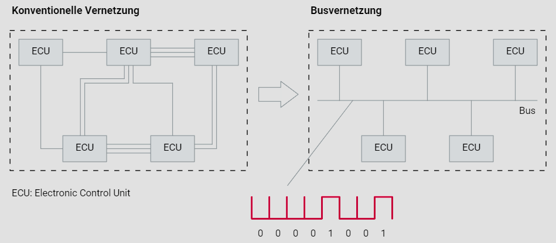

# 1. Einführung

## 1.1. Motivation für CAN

Die Geschichte der Automobilindustrie ist eine Geschichte ständiger Innovation und Anpassung an die sich verändernden Anforderungen und Herausforderungen. Die jüngsten Entwicklungen, die von einer verstärkten Integration von Elektronik geprägt sind, sind ein klares Zeichen dafür, wie die Branche sich kontinuierlich weiterentwickelt, um den wachsenden Bedürfnissen der Kunden und den strengen gesetzlichen Vorschriften gerecht zu werden. Die Evolution des Controller Area Networks (CAN) in der Automobilindustrie ist ein beeindruckendes Beispiel für technologische Innovation und Standardisierung, das die Art und Weise, wie Fahrzeuge entworfen, entwickelt und betrieben werden, revolutioniert hat.

Die zunehmende Komplexität moderner Fahrzeuge erforderte eine effizientere Methode zur Integration elektronischer Systeme. Frühe Ansätze mit eigenständigen Steuergeräten waren nicht mehr ausreichend, um den wachsenden Anforderungen gerecht zu werden. Die Einführung des CAN-Bus löste dieses Problem, indem es einen effizienten bitseriellen Datenaustausch über einen einzigen Kommunikationskanal ermöglichte.

Die Standardisierung von CAN durch Bosch in den 80er Jahren legte den Grundstein für eine nahtlose Kommunikation zwischen den verschiedenen elektronischen Steuergeräten im Fahrzeug. Die Zuverlässigkeit und Sicherheit der Datenübertragung des CAN-Bus erfüllen die Echtzeitanforderungen, die in der Automobilindustrie unerlässlich sind.

Durch die Implementierung von CAN wurden nicht nur die Verkabelungskosten und der Platzbedarf erheblich reduziert, sondern auch die Systemintegration vereinfacht. Komplexe und sperrige Kabelbäume gehören der Vergangenheit an, was zu einer schlankeren und effizienteren Fahrzeugarchitektur führt.

Die kontinuierliche Weiterentwicklung von CAN zeigt, wie Technologie dazu beiträgt, die Leistungsfähigkeit und Zuverlässigkeit moderner Fahrzeuge zu verbessern. Die Automobilindustrie setzt weiterhin auf CAN und baut auf dieser bewährten Technologie auf, um zukünftige Herausforderungen zu meistern und innovative Lösungen für die Mobilität von morgen zu entwickeln.

## 1.2. Standardisierung

Die CAN-Technologie wurde im Jahr 1994 standardisiert und ist hauptsächlich durch drei ISO-Dokumente definiert. Die ISO 11898-1 spezifiziert das CAN-Protokoll, das den Data Link Layer (MAC - Medium Access Control, LLC - Logical Link Control) und das Physical Layer (PLS - Physical Signalling) abdeckt, im Gegensatz zum Referenzmodell für Datenkommunikation.

Die Implementierung des CAN-Protokolls erfolgt in Hardware. Es gibt eine Vielzahl von CAN-Controllern, die sich hauptsächlich im Umgang mit CAN-Nachrichten unterscheiden und daher Unterschiede auf der Object Layer aufweisen. CAN-Controller werden in Full-CAN-Controller (mit Objektspeicherung) und Basic-CAN-Controller (ohne Objektspeicherung) unterteilt.

Die ISO-Dokumente ISO 11898-2 und ISO 11898-3 behandeln die beiden Unterschichten PMA (Physical Medium Attachment) und PMS (Physical Medium Specification) des Referenzmodells für Datenkommunikation. Sie beschreiben zwei verschiedene CAN Physical Layer: CAN-High-Speed Physical Layer und CAN-Low-Speed Physical Layer, wobei die Hauptunterschiede in der Spannungsdefinition und der Datenübertragungsgeschwindigkeit (Datenrate) liegen.

ISO 11898-3 ermöglicht Datenraten von bis zu 125 KBit/s und wird hauptsächlich im Komfortbereich des Automobils eingesetzt, während ISO 11898-2 Datenraten bis zu 1 MBit/s erlaubt und vor allem im Antriebs- und Fahrwerksbereich des Automobils verwendet wird. Die ISO 11898-5 beschreibt das Verhalten eines CAN-Knotens im "Low Power Mode" bezüglich der Datenübertragung in einem CAN-High-Speed CAN-Netzwerk.

Für die Unterschicht MDI (Medium Dependent Interface) des Physical Layers existiert kein Standard. Die CiA DS-102 (CiA: CAN in Automation) empfiehlt lediglich die Verwendung bestimmter Stecker (SUB-D9) und eine spezifische Steckerbelegung.

Die ISO 11898-1 definiert eine ereignisgesteuerte Kommunikation. Bei hoher Buslast können niedrig priorisierte CAN-Nachrichten zu Verzögerungen führen. Um eine deterministische Kommunikation in einem CAN-Netzwerk sicherzustellen, steht die ISO 11898-4 zur Verfügung. Diese erweitert den Data Link Layer und bietet eine Time Triggered Communication-Option für CAN-basierte Netzwerke.

Die untenstehende Grafik "Standard und Implementierung" veranschaulicht den Zusammenhang zwischen dem ISO/OSI-Referenzmodell für Datenkommunikation, dem CAN-Standard und der Implementierung.

