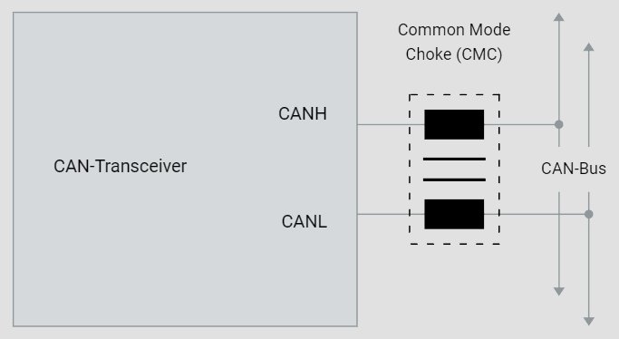
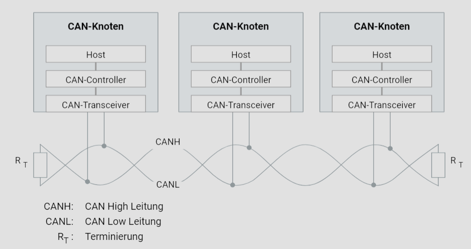
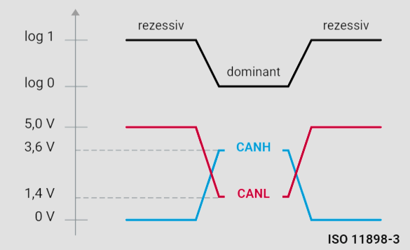
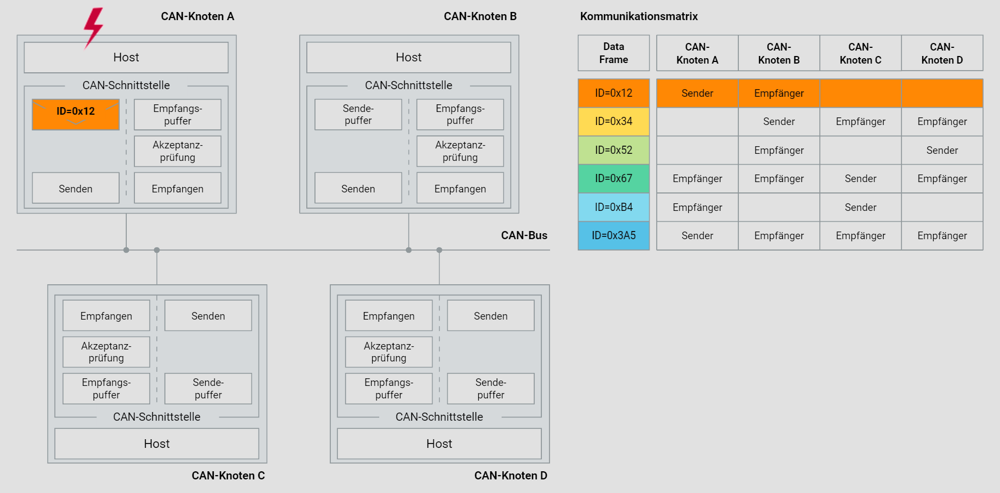

# 2. CAN-Kommunikation

## 2.1. CAN-Netzwerk

Ein CAN-Netzwerk besteht aus mehreren CAN-Knoten, die über ein physikalisches Übertragungsmedium, den CAN-Bus, miteinander verbunden sind. Typischerweise wird eine Linientopologie verwendet, bei der die elektronischen Steuergeräte passiv an einen linearen Bus angeschlossen sind. Alternativ kann auch eine passive Sterntopologie eingesetzt werden.

Das physikalische Übertragungsmedium besteht meistens aus einer verdrillten, ungeschirmten Zweidrahtleitung (Unshielded Twisted Pair - UTP), die eine symmetrische Signalübertragung ermöglicht. Diese UTP-Kabel haben typischerweise einen Leitungsquerschnitt zwischen 0,34 mm² und 0,6 mm². Der Widerstandsbelag der Leitung sollte weniger als 60 mΩ/m betragen.

Die maximale Datenrate eines CAN-Netzwerks beträgt 1 MBit/s, und die maximale Netzwerkausdehnung beträgt etwa 40 Meter. Um Reflexionen zu vermeiden, werden an den Enden des CAN-Netzwerks Busabschlusswiderstände verwendet. Die ISO 11898 legt die maximale Anzahl von CAN-Knoten auf 32 fest.

Durch diese Strukturierung und die klar definierten Randbedingungen wird eine effiziente und zuverlässige Kommunikation zwischen den verschiedenen Knoten im Netzwerk gewährleistet. Die Standardisierung erleichtert die Implementierung und den Betrieb von CAN-Netzwerken in verschiedenen Anwendungsbereichen, insbesondere im Automobilsektor.

## 2.2. CAN-Knoten

Mit der zunehmenden Elektrifizierung von Fahrzeugen steigt die Anzahl und Komplexität der Softwarefunktionen rapide an. Moderne Oberklassefahrzeuge verfügen über mehr als 1000 Software-Funktionen und über 70 elektronische Steuergeräte, die in verschiedenen Bussystemen kommunizieren. Ein elektronisches Steuergerät, das im CAN-Netzwerk arbeitet, wird als CAN-Knoten bezeichnet.

Früher reichte ein einfacher CAN-Treiber aus, der eine einfache, hardwareunabhängige Schnittstelle für Anwendungen bereitstellte. Heute sind jedoch ein Betriebssystem sowie Funktionen für Netzwerkmanagement und Diagnose unverzichtbar. Die steigende Softwarekomplexität erfordert eine Standardisierung der Steuergeräteinfrastruktur.

Eine einheitliche Software verringert den Entwicklungsaufwand und erleichtert die Wartung. Sie fördert auch die Wiederverwendbarkeit und Austauschbarkeit von Software-Komponenten zwischen verschiedenen Fahrzeugplattformen sowie zwischen OEMs (Original Equipment Manufacturer) und Zulieferern.

AUTOSAR (AUTomotive Open System ARchitecture) bietet eine Referenzarchitektur für die Steuergerätesoftware. Das AUTOSAR Runtime Environment (RTE) entkoppelt das Netzwerk vollständig von den Software-Komponenten der Applikation. Das RTE bietet den Software-Komponenten einheitliche Dienste in Form der Basis-Software an, die aus drei Ebenen besteht: Microcontroller Abstraction Layer, ECU Abstraction Layer und Service Layer.

Die Abbildung oben zeigt den Aufbau eines modernen CAN-Knotens. Besonders interessant ist der Bereich "Communication Services", der die verschiedenen Kommunikationsdienste und -protokolle des Knotens darstellt. AUTOSAR COM stellt standardisierte Kommunikationsdienste für den Datenaustausch zwischen den Komponenten des CAN-Knotens bereit, darunter:

- **Standardkommunikationsdienste**: Ermöglichen den Austausch von Nachrichten zwischen den Steuergeräten über das CAN-Netzwerk.
- **Diagnosedienste (Diagnostic COM Manager)**: Stellen Dienste für die Fahrzeugdiagnose zur Verfügung, z.B. für das Auslesen von Fehlercodes.
- **Netzwerkmanagementdienste (Generic NM/CAN NM)**: Verwalten und koordinieren die Kommunikation im CAN-Netzwerk, z.B. das Ein- und Ausschalten von Steuergeräten.

Der PDU (Protocol Data Unit) Router koordiniert den Datenaustausch zwischen den verschiedenen Kommunikationsschichten des CAN-Knotens, sorgt für eine reibungslose Kommunikation und verbindet AUTOSAR COM, den Diagnostic COM Manager und das CAN TP (Transportprotokoll).

## 2.3. CAN-Controller

Für die Teilnahme an der CAN-Kommunikation benötigt ein elektronisches Steuergerät eine CAN-Schnittstelle, bestehend aus einem **CAN-Controller** und einem **CAN-Transceiver**. Der CAN-Controller übernimmt die vorgeschriebenen Kommunikationsfunktionen des CAN-Protokolls und entlastet dabei den Host erheblich.

Der **CAN-Transceiver** ermöglicht die Verbindung des CAN-Controllers mit dem physikalischen Übertragungsmedium. In der Regel sind beide Komponenten durch Optokoppler galvanisch getrennt, um Überspannungen auf dem CAN-Bus abzufangen und den CAN-Controller sowie den Host zu schützen.

Die CAN-Knoten in einem Netzwerk unterscheiden sich hinsichtlich der Anzahl und Frequenz der zu sendenden und empfangenden CAN-Botschaften. Diese Unterschiede haben zu zwei grundlegenden CAN-Controller-Architekturen geführt: mit und ohne Objektspeicherung.

CAN-Controller können entweder integriert oder als eigenständige Bausteine (stand-alone) verwendet werden. In der Stand-Alone-Variante wird der CAN-Controller vom Mikrocontroller wie ein Speicherbaustein behandelt, was mehr Flexibilität bietet. Die On-Chip-Variante nimmt weniger Platz ein und ermöglicht eine schnellere und zuverlässigere Kommunikation zwischen Mikrocontroller und CAN-Controller.

## 2.4. CAN-Transceiver

Früher wurde die Verbindung des CAN-Controllers mit dem Kommunikationsmedium (CAN-Bus) oft diskret realisiert. Heute übernehmen CAN-Transceiver diese Aufgabe. Da die physikalische Signalübertragung in einem CAN-Netzwerk symmetrisch erfolgt und das Übertragungsmedium aus zwei Leitungen besteht, verfügt ein CAN-Transceiver stets über zwei Buspins: einen für die CAN-High-Leitung (CANH) und einen für die CAN-Low-Leitung (CANL).

Man unterscheidet zwischen High-Speed-CAN-Transceivern und Low-Speed-CAN-Transceivern. High-Speed-CAN-Transceiver unterstützen Datenraten von bis zu 1 MBit/s, während Low-Speed-CAN-Transceiver nur Datenraten von bis zu 125 KBit/s unterstützen. Low-Speed-CAN-Transceiver gewährleisten eine fehlertolerante Busankopplung, sodass der Ausfall einer der beiden Kommunikationsleitungen nicht zum Ausfall des Kommunikationsbetriebs führt.

Die Abbildung unten zeigt den grundlegenden Aufbau eines High-Speed-CAN-Transceivers. Bei gesperrten Ausgangstransistoren nehmen beide CAN-Leitungen dasselbe Potenzial (0,5*Vcc) an – die Differenzspannung beträgt Null. Sobald beide Transistoren durchschalten, entsteht zwischen den Leitungen eine spannungsabhängige Differenzspannung. Gemäß ISO 11898-2 sollte diese Differenz 2 Volt betragen, wobei ein Strom von etwa 35 mA fließt.

CAN-Transceiver sorgen für geringe Emissionen und bieten durch einen breiten Gleichtaktarbeitsbereich eine hohe Störfestigkeit. Sie verfügen heutzutage über einen ESD-Schutz von bis zu 8 kV. Trotz hoher Gleichtaktunterdrückung kann in besonders kritischen Anwendungsbereichen eine Gleichtaktdrossel (Common Mode Choke - CMC) helfen, die Emissionen weiter zu reduzieren.

Die ISO 11898 gibt die maximale Anzahl von CAN-Knoten mit 32 an. In der Praxis hängt die maximale Anzahl von CAN-Knoten jedoch von der Leistungsfähigkeit der eingesetzten CAN-Transceiver und davon ab, ob es sich um ein CAN-High-Speed- oder CAN-Low-Speed-Netzwerk handelt. Beispielsweise können bis zu 110 CAN-Knoten in einem CAN-High-Speed-Netzwerk verbunden werden, wenn der High-Speed-CAN-Transceiver TJA1050 verwendet wird.

## 2.5. CAN-Bus

Die physikalische Übertragung von Signalen in einem CAN-Netzwerk basiert auf der Übermittlung von Spannungsdifferenzen, bekannt als Differenzialsignalübertragung. Störspannungen, die durch Motoren, Zündanlagen und Schaltkontakte erzeugt werden, können auf diese Weise effektiv neutralisiert werden. Das Übertragungsmedium, der CAN-Bus, besteht daher aus zwei Leitungen: der CAN-High-Leitung (CANH) und der CAN-Low-Leitung (CANL). Das Verdrillen der beiden Leitungen verringert das magnetische Feld erheblich, weshalb in der Praxis verdrillte Leiterpaare (Twisted Pair) verwendet werden.

Mit steigender Datenrate oder wachsender Busausdehnung nimmt der Einfluss von Reflexionen zu. Durch die Terminierung der Enden des Kommunikationskanals mit Abschlusswiderständen, die die elektrischen Eigenschaften des Übertragungsmediums nachbilden, werden Reflexionen in einem CAN-High-Speed-Netzwerk

 verhindert. Der Busabschlusswiderstand entspricht dem Wellenwiderstand der elektrischen Leitung, der 120 Ohm beträgt. Im Gegensatz zur ISO 11898-2, die Busabschlusswiderstände vorschreibt, sieht die ISO 11898-3 (CAN-Low-Speed) aufgrund der geringeren maximalen Datenrate von 125 KBit/s keine Busabschlusswiderstände vor.

## 2.6. CAN-Buspegel

Die physische Übertragung von Signalen in einem CAN-Netzwerk basiert auf der Übertragung von Differenzsignalen. Die Höhe der Differenzspannungen wird durch die verwendete Buskopplung bestimmt. Es gibt zwei Hauptarten von Buskopplungen: die CAN-Highspeed-Buskopplung (ISO 11898-2) und die CAN-Lowspeed-Buskopplung (ISO 11898-3).

Nach ISO 11898-2 wird der logischen 1 eine typische Differenzspannung von 0 Volt zugeordnet, während der logischen 0 eine typische Differenzspannung von 2 Volt zugewiesen wird. CAN-Highspeed-Transceiver interpretieren eine Differenzspannung von mehr als 0,9 Volt als dominanten Pegel, innerhalb des Gleichtaktarbeitsbereichs, der normalerweise zwischen 12 Volt und -12 Volt liegt.

Eine Differenzspannung unterhalb von 0,5 Volt wird als rezessiver Pegel betrachtet. Um die Immunität gegenüber Störspannungen zu erhöhen, ist eine Hysterese-Schaltung integriert. ISO 11898-3 weist der logischen 1 eine typische Differenzspannung von 5 Volt zu und der logischen 0 eine typische Differenzspannung von 2 Volt.

Die Grafiken "CAN-Highspeed-Buspegel" und "CAN-Lowspeed-Buspegel" veranschaulichen die verschiedenen Spannungsverhältnisse auf dem CAN-Bus.

## 2.7. CAN-Buslogik

Dominante und rezessive Buspegel sind für den störungsfreien Betrieb von CAN-Netzwerken entscheidend. Sie beeinflussen den Buszugriff, die Fehlererkennung und die Bestätigung (Acknowledgement) der Übertragungen. Der dominante Buspegel repräsentiert die logische „0“, während der rezessive Buspegel der logischen „1“ entspricht. Der dominante Pegel hat Vorrang vor dem rezessiven, sodass bei gleichzeitiger Übertragung von dominanten und rezessiven Pegeln der Bus den dominanten Pegel annimmt. Der rezessive Pegel tritt nur auf, wenn alle CAN-Knoten im rezessiven Zustand senden.

Dieses Verhalten kann als logische UND-Verknüpfung interpretiert werden. Die physische Umsetzung erfolgt mithilfe einer Open-Collector-Schaltung. Zur Veranschaulichung der zugrunde liegenden Wired-AND-Buslogik in CAN-Netzwerken empfiehlt sich die interaktive Grafik „Buslogik“.

## 2.8. Kommunikationsprinzip

In sicherheitskritischen Anwendungsbereichen wie dem Antriebsstrang müssen hohe Anforderungen an die Verfügbarkeit eines Kommunikationssystems erfüllt werden. Es wäre ungünstig, die Buszuteilung einem einzigen Busknoten zu übertragen, da ein Ausfall dieses Knotens zu einem Kommunikationsausfall führen könnte. Eine bessere Lösung ist die Dezentralisierung des Buszugriffs, sodass jeder Busknoten das Recht hat, auf den Bus zuzugreifen.

Ein CAN-Netzwerk basiert auf einer Kombination aus **Multi-Master-Architektur** und Linientopologie. In einem solchen Netzwerk ist jeder CAN-Knoten berechtigt, CAN-Botschaften zu senden. Die Übertragung von CAN-Botschaften erfolgt ereignisorientiert, und der Kommunikationskanal wird nur dann belegt, wenn tatsächlich neue Informationen übertragen werden müssen. Diese Architektur ermöglicht schnelle Buszugriffe und Echtzeitdatenübertragungen im Millisekundenbereich.

Um Abhängigkeiten zwischen den Busknoten zu verhindern und die Konfigurationsflexibilität zu erhöhen, wird im CAN-Netzwerk eine empfängerselektive Adressierung verwendet. Jede CAN-Botschaft steht jedem CAN-Knoten zur Verfügung (Broadcasting), vorausgesetzt, sie ist durch eine Botschaftskennung (Identifier - ID) gekennzeichnet und wird durch eine knotenindividuelle Filterung gesteuert. Dies ermöglicht die Integration weiterer CAN-Knoten ohne Modifikation des CAN-Netzwerks.

Das unten dargestellte "Kommunikationsprinzip" veranschaulicht die Botschaftsübertragung in einem CAN-Netzwerk. Der Ablauf zeigt den Umgang mit einer CAN-Kommunikationsmatrix und der Akzeptanzfilterung, sowie den typischen Ablauf der Kommunikation:

1. Ein Ereignis im Host des CAN-Knotens A führt zur Speicherung der entsprechenden Nutzdaten und der zugehörigen Identifier ID=0x12 und dem DLC im Sendepuffer des CAN-Controllers. Der CAN-Controller sendet den Pufferinhalt, sobald der CAN-Bus frei ist.

   
2. Der CAN-Controller des CAN-Knotens A ergänzt den Pufferinhalt mit zusätzlichen Informationen (u.a. Prüfsumme), fasst ihn zum Data Frame zusammen und sendet diesen "Broadcast" gemäß dem CAN-Protokoll.

   
3. Der Data Frame wird von den CAN-Knoten B, C und D empfangen. Die jeweiligen CAN-Controller prüfen den empfangenen Data Frame auf Korrektheit.

   
