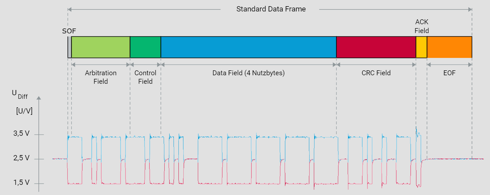

# 3. CAN-Framing

## 3.1. Frametypen

Für die Übertragung von Nutzdaten sieht die ISO 11898-1 den sogenannten Data Frame vor. Ein Data Frame kann höchstens acht Nutzbytes übertragen. Dafür steht das sogenannte Data Field zur Verfügung, das von verschiedenen Feldern umgeben ist, die für die Abwicklung des CAN-Kommunikationsprotokolls notwendig sind. Dazu gehören unter anderem die Botschaftsadresse (Identifier - ID), der Data Length Code (DLC), die Prüfsumme (Cyclic Redundancy Check Sequence - CRC Sequence) und die Empfangsbestätigung im Acknowledgement Field.

Während bei der Übertragung von Data Frames die entsprechenden Informationsquellen die Initiative ergreifen, gibt es mit dem Remote Frame einen Frametyp, mit dem Nutzdaten (also Data Frames) von beliebigen CAN-Knoten angefordert werden können. Abgesehen vom fehlenden Data Field hat ein Remote Frame den gleichen Aufbau wie ein Data Frame.

Der Error Frame steht zur Verfügung, um während des Kommunikationsbetriebs entdeckte Fehler zu signalisieren. Beim Übertragen eines Error Frames wird die laufende Botschaftsübertragung abgebrochen. Der Aufbau eines Error Frames unterscheidet sich wesentlich vom Aufbau eines Data oder Remote Frames. Es gibt lediglich zwei Felder zu unterscheiden: das Error Flag und den Error Delimiter.

## 3.2. Data Frame

Innerhalb eines CAN-Netzwerks spielen Data Frames eine entscheidende Rolle, indem sie für die Übertragung von Nutzdaten verantwortlich sind. Ein Data Frame setzt sich aus verschiedenen Komponenten zusammen, von denen jede während der Übertragung eine wichtige Funktion erfüllt. Diese umfassen die Initiierung und Aufrechterhaltung der Synchronisation zwischen den Kommunikationspartnern, die Herstellung der in der Kommunikationsmatrix definierten Kommunikationsbeziehungen sowie die Übertragung und Sicherung der Nutzdaten.

Die Übertragung eines Data Frames beginnt mit dem Startbit, auch als Start Of Frame (SOF) bezeichnet. Der Sender überträgt dieses Bit dominant und sorgt durch einen Flankenwechsel von rezessiv (Bus Idle) zu dominant für eine netzwerkweite Synchronisation. Um während der Übertragung die Synchronität zum Sender aufrechtzuerhalten, vergleichen die Empfänger alle Signalflanken, die von rezessiv zu dominant wechseln, mit ihrem eingestellten Bittiming. Bei Abweichungen synchronisieren sich die Empfänger entsprechend, um etwaige Phasenfehler auszugleichen (Nachsynchronisation).

Dem SOF folgt der Identifier (ID), der die Priorität des Data Frames festlegt und in Kombination mit der Akzeptanzfilterung die im CAN-Netzwerk definierten Sender-Empfänger-Relationen gewährleistet. Durch das RTR-Bit (Remote Transmission Request) informiert der Sender die Empfänger über den Frametyp (Data Frame oder Remote Frame). Ein dominantes RTR-Bit zeigt dabei an, dass es sich um einen Data Frame handelt.

Das anschließende IDE-Bit (Identifier Extension) dient dazu, zwischen Standard-Format und Extended-Format zu unterscheiden. Im Standard-Format beträgt der Identifier 11 Bit, während er im Extended-Format 29 Bit umfasst. Eine detaillierte Darstellung beider Formate finden Sie in der Grafik „Data Frame im Standard- und Extended-Format“.

Der DLC (Data Length Code) informiert die Empfänger über die Anzahl der Nutzbytes. Die eigentlichen Nutzbytes werden im Data Field transportiert, wobei maximal acht Nutzbytes pro Data Frame übertragen werden können.

Die Sicherung der Nutzbytes erfolgt durch eine Prüfsumme, die mittels des Cyclic Redundancy Checks (CRC) berechnet wird. Basierend auf dem Ergebnis des CRC bestätigen die Empfänger im ACK-Slot positiv oder negativ (Acknowledgement).

Die Übertragung eines Data Frames wird durch sieben rezessive Bits (EOF - End Of Frame) abgeschlossen.

## 3.3. Remote Frame

Anforderung von Daten und Remote Frames:

Neben den üblichen Data Frames für die Datenübertragung gibt es den Remote Frame, der es ermöglicht, Nutzdaten (Data Frames) von beliebigen CAN-Knoten anzufordern. Im Automobilsektor findet dieser Frametyp jedoch selten Anwendung, da die Datenübertragung dort hauptsächlich auf der Initiative der Informationserzeuger basiert und nicht auf Anfrage. Remote Frames können sowohl im Standard- als auch im Extended-Format übertragen werden.

RTR zur Unterscheidung:

Der Remote Frame ähnelt dem Data Frame im Aufbau, abgesehen vom fehlenden Data Field. Die Unterscheidung zwischen Data und Remote Frame erfolgt durch das RTR-Bit (Remote Transmission Request). Bei einem Data Frame wird das RTR-Bit dominant gesendet, während ein Remote Frame durch ein rezessives RTR-Bit gekennzeichnet ist.

Zwei Frames, ein Identifier:

Grundsätzlich können für alle existierenden Data Frames im CAN-Netzwerk entsprechende Remote Frames definiert werden. Dabei muss darauf geachtet werden, dass die Identifier der Remote Frames den Identifiern der zugehörigen Data Frames entsprechen. Wenn ein CAN-Knoten einen Remote Frame empfängt, dessen ID mit dem ID eines eigenen Data Frames übereinstimmt, antwortet er mit dem entsprechenden Data Frame.

Remote Frames und deren Beantwortung:

Bei einem CAN-Controller mit Objektespeicherung erfolgt die Beantwortung eines Remote Frames automatisch durch den CAN-Controller. CAN-Controller ohne Objektespeicherung müssen den Host darüber informieren, damit dieser die Beantwortung initiieren kann.

Im Idealfall erfolgt die Antwort auf die Anfrage mittels Remote Frame sofort durch das entsprechende Data Frame. Allerdings können sich unter Umständen CAN-Botschaften mit höherer Priorität zwischen Anfrage und Antwort schieben.

## 3.4. Adressierung

Botschafts-Adressierung im CAN-Netzwerk:

Die Kommunikation im CAN-Netzwerk basiert auf einer inhaltsbezogenen Adressierung. Anstelle der CAN-Knoten werden die Data- und Remote-Frames mit einer Kennung (Identifier - ID) versehen. Dadurch stehen alle CAN-Botschaften jedem CAN-Knoten zur Verfügung (Broadcasting). Die Auswahl der empfangenen CAN-Botschaften liegt in der Verantwortung jedes Empfängers, was zu einer empfängerselektiven Adressierung führt. Diese Form der Adressierung ist äußerst flexibel, erfordert jedoch eine empfängerseitige Filterung der empfangenen CAN-Botschaften (Akzeptanzfilterung).

Standard- und Extended-Format:

Der Anwender kann zwischen zwei Botschaftsformaten wählen: Standard- und Extended-Format. Beide Formate unterscheiden sich in der Länge des Identifiers. Das Standard-Format umfasst einen 11-Bit-ID, während das Extended-Format einen 29-Bit-ID verwendet.

Im Extended-Format setzt sich der ID im Gegensatz zum Standard-Format aus zwei Komponenten zusammen: dem Basis-ID und dem Extended-ID. Zwischen beiden Komponenten befinden sich die beiden Bits IDE (Identifier Extension) und SRR (Substitute Remote Request).

Ein dominantes IDE-Bit kennzeichnet eine CAN-Botschaft im Standard-Format, während ein rezessives IDE-Bit eine CAN-Botschaft im Extended-Format identifiziert. Im Extended-Format ersetzt das stets rezessiv übertragene SRR-Bit das RTR-Bit im Standard-Format. Die beiden ersten Bits des Control-Fields (r0 und r1) im Extended-Format haben keine Bedeutung und werden beide dominant übertragen.

## 3.5. CRC und Acknowledgement

Übertragungssicherheit im CAN-Netzwerk:

Eine der zentralen Herausforderungen bei der seriellen Kommunikation im Kraftfahrzeug besteht in der Gewährleistung höchster Übertragungssicherheit. Hierbei kommt dem CRC-Verfahren (CRC: Cyclic Redundancy Check) als äußerst leistungsstarkem Fehlererkennungsverfahren eine zentrale Rolle zu.

CRC-Sequenzberechnung:

Im Rahmen des CRC-Verfahrens wird eine CRC-Sequenz basierend auf den zu übertragenden Bits (vom Start of Frame bis zum Ende des Data Fields) und einem durch die ISO 11898-1 definierten Generatorpolynom G(x) berechnet. Diese CRC-Sequenz wird den zu übertragenden Bits angehängt, wobei das Gesamtpolynom dem Vielfachen der zu übertragenden Bits entspricht. Der Empfänger erkennt einen Übertragungsfehler mit hoher Sicherheit, indem er die Division durch das Generatorpolynom auf Rest prüft (Ausnahme: CRC-Sequenz selbst wurde gestört).

Acknowledgement-Verfahren:

Basierend auf dem Ergebnis der Division steuert jeder Empfänger unabhängig von der Akzeptanzfilterung das Acknowledgement. Ein Empfänger quittiert entweder positiv oder negativ. Ein dominanter Pegel im ACK-Slot entspricht einer positiven, ein rezessiver Pegel einer negativen Quittung.

ACK-Delimiter und interaktive Animation:

Der ACK-Delimiter wird aus Gründen der Fehlerverfolgung immer rezessiv übertragen. Da der Sender sowohl den ACK-Slot als auch den ACK-Delimiter rezessiv überträgt, genügt eine positive Quittung, um die Korrektheit der Botschaftsübertragung zu bestätigen. Das Acknowledgement im CAN-Netzwerk wird daher auch als knotenneutrales positives Acknowledgement bezeichnet. Eine interaktive Animation ermöglicht eine interaktive Auseinandersetzung mit dem Acknowledgement im CAN-Netzwerk und zeigt ein Beispiel mit einem Sender und zwei positiv quittierenden Empfängern.

ACK-Fehler und Error Flag:

Durch das knotenneutrale positive Acknowledgement werden negativ quittierende CAN-Knoten überschrieben und bleiben vorerst unbeachtet. Um netzweite Datenkonsistenz zu gewährleisten, senden diese Knoten nach dem ACK-Delimiter ein Error Flag. Fehlt jegliche positive Quittung und bleibt der ACK-Slot unüberschrieben, erkennt der Sender einen ACK-Fehler und bricht die laufende Nachrichtenübertragung durch das Aufschalten eines Error Flags sofort ab. Ein ACK-Fehler weist auf einen Fehler seitens des Senders oder das Fehlen von Empfängern hin.

## 3.6. Bitstuffing

Synchronisation und Resynchronisation in CAN-Kommunikation:

Die korrekte Datenübertragung in einem CAN-Netzwerk erfordert synchronisierte Kommunikationspartner. Der Gleichlauf wird durch die wechselnde Signalflanke des Startbits (Start of Frame - SOF) einer CAN-Botschaft hergestellt. Ein Resynchronisationsmechanismus gewährleistet, dass dieser Gleichlauf während der gesamten Botschaftsübertragung erhalten bleibt.

Der Resynchronisationsmechanismus basiert auf der Auswertung der Signalflanken, die von rezessiv nach dominant wechseln. Der Bitstuffingmechanismus sorgt dafür, dass solche Signalflanken gesichert sind. Gemäß ISO 11898-1 wird den Sendern vorgeschrieben, spätestens nach fünf homogenen Bits ein komplementäres Bit zu übertragen, auch wenn ohnehin nach fünf homogenen Bits ein komplementäres Bit folgen würde.

Bitstuffing-Bereich und Data Frame:

Der Bitstuffing-Bereich erstreckt sich von der Übertragung des SOF bis zum letzten Bit der CRC-Sequenz. Im Standard-Format eines Data Frames, insbesondere im Worst-Case-Szenario, wenn das Data Field acht Nutzbytes umfasst, können theoretisch bis zu 24 Stuffbits auftreten. Somit setzt sich der längstmögliche Data Frame im Standard-Format theoretisch aus 132 Bit zusammen.

Um den Bitstuffingmechanismus besser zu verstehen, bietet die interaktive Grafik "Bitstuffing" eine anschauliche Darstellung.
