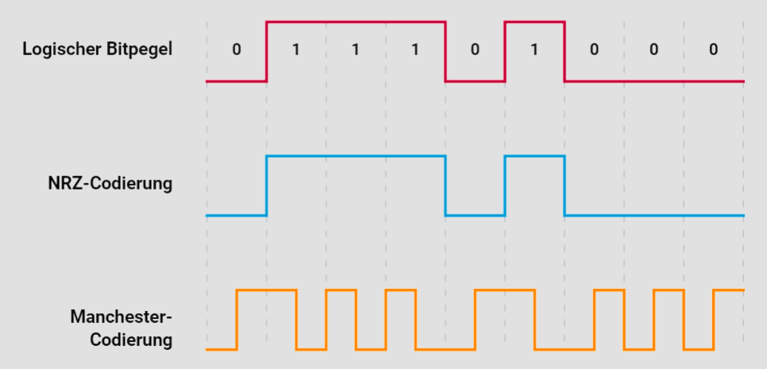
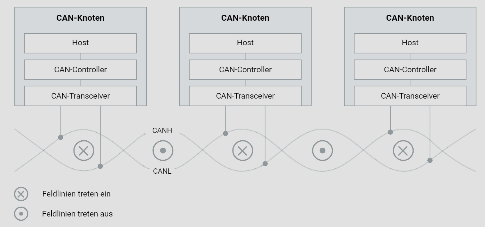
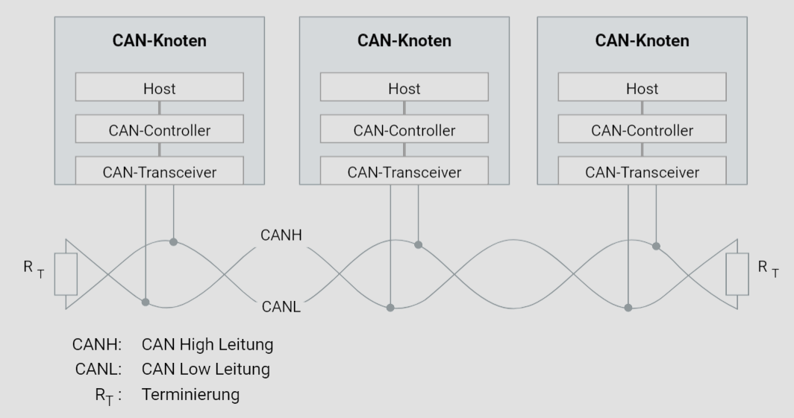
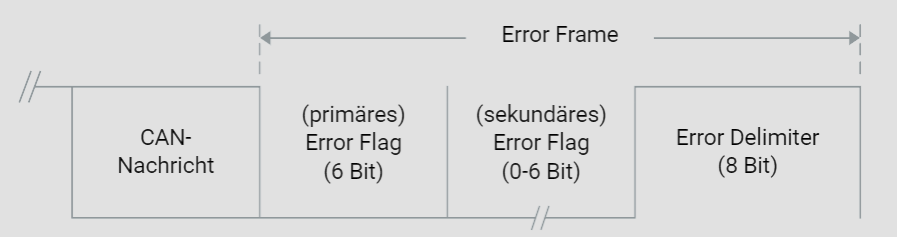
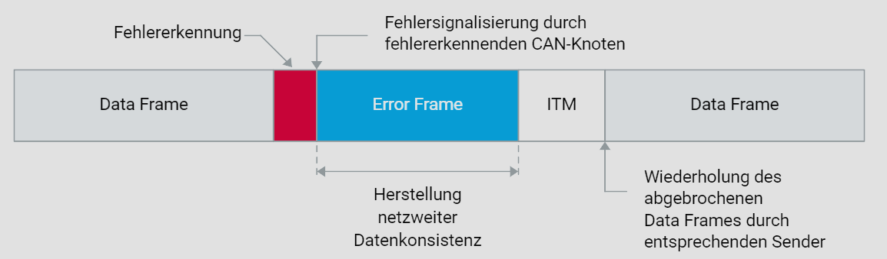

# 5. CAN-Datensicherung

## 5.1. Prinzip der Datensicherung

Das Prinzip der Datensicherung von entscheidender Bedeutung für die Sicherheit elektronischer Systeme. Insbesondere das Controller Area Network (CAN) muss nicht nur den strengen Anforderungen an Echtzeitfähigkeit genügen, sondern auch eine zuverlässige und sichere Datenübertragung gewährleisten. Dies ist essenziell, da das CAN-Bussystem auch in hochkritischen Anwendungen im Fahrzeug eingesetzt wird, wo höchste Anforderungen an die Datenintegrität gestellt werden.

Elektromagnetische Verträglichkeit (EMV) spielt eine zentrale Rolle bei der Sicherung der Datenintegrität. Dies bedeutet, dass das Design des Systems bereits auf physikalischer Ebene darauf ausgerichtet sein muss, Störungen von außen abzuwehren und eine zuverlässige Datenübertragung sicherzustellen. Traditionell wird daher der EMV bei der Systemauslegung große Aufmerksamkeit geschenkt.

Verschiedene Fehlerquellen können die Datenintegrität beeinträchtigen, trotz eines EMV-konformen Designs und physikalischer Sicherungsmaßnahmen. Dazu gehören galvanische, induktive und kapazitive Kopplungen sowie Signalstörungen und -verzerrungen. Auch Unterschiede in Abtastzeitpunkten, Schaltschwellen und Frequenzabweichungen zwischen den Kommunikationspartnern können zu Problemen führen, wodurch eine störungsfreie Datenübertragung nicht garantiert werden kann.

Um die Restfehlerwahrscheinlichkeit zu minimieren und damit die Datenintegrität zu erhöhen, gibt es zwei grundlegende Strategien:

1. Vermeidung von Datenverfälschungen durch elektromagnetisch verträgliche Netzwerkauslegung und physikalische Maßnahmen wie zum Beispiel die Verwendung von Twisted Pair Kabeln.
2. Erkennung und Korrektur von verfälschten Daten durch leistungsfähige Fehlererkennungs- und Fehlerbehandlungsmechanismen auf logischer Ebene.

## 5.2. NRZ-Codierung

Bitcodierung spielt eine entscheidende Rolle beim Umgang mit Störungen, da sie die Emissionen und die Störfestigkeit beeinflusst. Eine effektive Bitcodierung trägt dazu bei, die Emissionen zu reduzieren, während gleichzeitig die Anforderungen an die Transportkapazität erfüllt werden müssen.

Eine gängige Bitcodierung im Kontext des Controller Area Network (CAN) Protokolls ist die Non-Return-to-Zero (NRZ)-Bitcodierung. Bei NRZ wird jede Binärzahl direkt in ein elektrisches Signal umgesetzt, wobei eine logische "1" durch einen hohen Pegel und eine logische "0" durch einen niedrigen Pegel repräsentiert wird. Ein charakteristisches Merkmal der NRZ-Codierung ist, dass aufeinanderfolgende Bits gleicher Polarität keine Pegeländerung verursachen.

NRZ-Codierung ermöglicht hohe Datenraten und begrenzt die Emissionen. Allerdings fehlt ihr die Eigenschaft der Selbsttaktung, was bedeutet, dass sie keine eingebaute Synchronisierung besitzt. Wenn es also über längere Zeit keine Pegeländerung gibt, kann der Empfänger die Synchronisation verlieren. Aus diesem Grund erfordert die Verwendung von NRZ-Codierung einen spezifischen Synchronisationsmechanismus, der jedoch die Effizienz der Datenübertragung verringert.

Um die Synchronisation zu gewährleisten, wird im CAN-Protokoll das Bitstuffingverfahren verwendet. Hierbei fügt der Sender nach einer bestimmten Anzahl von homogenen Bits ein komplementäres Bit in den Bitstrom ein. Im Gegensatz dazu benötigt beispielsweise die Manchester-Codierung keinen solchen Mechanismus, da sie selbsttaktend ist.

## 5.3. Twisted Pair

In der Welt des Controller Area Network (CAN)-Protokolls spielt die Twisted-Pair-Verkabelung eine entscheidende Rolle für eine zuverlässige und störungsfreie Kommunikation. Diese Methode der Signalübertragung bietet eine symmetrische Übertragungsumgebung, die dazu beiträgt, Störungen effektiv zu bekämpfen und die Integrität der Daten zu gewährleisten.Symmetrische Signalübertragung zur Störungsbekämpfung

Ein herausragendes Merkmal von Twisted-Pair ist die **symmetrische Signalübertragung**. Diese Technik reagiert auf externe Störungen, wie sie beispielsweise durch Motoren, Zündanlagen und Schaltkontakte erzeugt werden, indem sie diese Störungen auf beide Leitungen gleichermaßen verteilt. Dadurch wird das Nutzsignal nicht beeinträchtigt, da das Störsignal durch Differenzbildung effektiv aufgehoben wird.

Die **Differenzbildung** ist ein entscheidender Mechanismus bei der symmetrischen Signalübertragung. Durch die Übertragung der Differenz zwischen den Signalen auf den beiden Leitungen des Twisted Pairs werden Störsignale eliminiert, während das Nutzsignal intakt bleibt. Dieser Prozess gewährleistet eine hohe Signalintegrität selbst unter schwierigen Umgebungsbedingungen.

Ein weiterer Vorteil der Twisted-Pair-Verkabelung liegt in der Nutzung **magnetischer Felder zur Abschirmung**. Durch das Verdrillen der Leitungspaare entstehen magnetische Felder, die sich gegenseitig aufheben und so die Abstrahlung von Störsignalen minimieren. Diese Abschirmung trägt wesentlich zur Störungsimmunität des CAN-Bus-Systems bei.

Die **Effektivität des Verdrillens** hängt von der Anzahl der Umschlingungen pro Meter ab. Je mehr Umschlingungen vorhanden sind, desto besser werden Störeinflüsse neutralisiert. Eine Mindestanzahl von 30 Umschlingungen pro Meter ist empfehlenswert, um eine effektive Abschirmung und damit eine zuverlässige Signalübertragung sicherzustellen.

Insgesamt bietet die Twisted-Pair-Verkabelung im CAN-Protokoll eine robuste Lösung zur Übertragung von Daten in anspruchsvollen Umgebungen, indem sie Störungen wirksam bekämpft und eine zuverlässige Kommunikation gewährleistet.

## 5.4. Terminierung

Bei der Übertragung von Daten auf dem CAN-Bus, insbesondere in Hig-Speed-Netzwerken, ist die Terminierung ein entscheidender Aspekt. Mit zunehmender Datenrate treten aufgrund der begrenzten Signalausbreitung Ausgleichsvorgänge in Form von Reflexionen auf. Um diesen Effekten entgegenzuwirken, müssen die Enden des Busses mit dem Wellenwiderstand des physikalischen Übertragungsmediums abgeschlossen werden. Der Wellenwiderstand des Kommunikationskanals beträgt dabei 120 Ohm.

Statt einzelne Busabschlusswiderstände an den Enden des Kommunikationskanals zu verwenden, kann alternativ ein geteilter Busabschluss eingesetzt werden. Dieser besteht aus zwei identischen Widerständen mit jeweils 60 Ohm und einer Kapazität, typischerweise 4,7 nF. Der geteilte Busabschluss fungiert als Tiefpassfilter, der hochfrequente Signale gegen Masse kurzschließt, ohne die Gleichspannungsverhältnisse zu beeinträchtigen. Untersuchungen haben gezeigt, dass diese Terminierungsmethode sowohl die Störfestigkeit verbessert als auch die Emissionen reduziert.

## 5.5. Logische Fehlererkennung

Um sicherzustellen, dass die über das CAN-Netzwerk übertragenen Nachrichten korrekt und zuverlässig sind, definiert das Protokoll mehrere Mechanismen zur Erkennung von verfälschten Botschaften. Diese Mechanismen sind entscheidend für die Integrität und Zuverlässigkeit des Kommunikationssystems.

- Bitmonitoring
- Überwachung des Botschaftsformats (Form-Check)
- Überwachung der Bitcodierung (Stuff-Check)
- Auswertung des Acknowledgements (ACK-Check)
- Auswertung der Prüfsumme (Cyclic Redundancy Check).

**Aufgaben für Sender und Empfänger**

- Die Fehlererkennungsmechanismen Bitmonitoring und ACK Check werden vom Sender einer CAN-Botschaft wahrgenommen.
- Unabhängig von der Akzeptanzfilterung kümmern sich die Empfänger um Form Check, Stuff Check und Cyclic Redundancy Check.
- Die Grafik „Fehlererkennung“ zeigt Ihnen, welche Felder eines Data oder Remote Frames von den einzelnen Fehlererkennungsmechanismen betroffen sind.

**1. Stuff Check - Empfänger:**

Der Stuff Check ist ein entscheidender Mechanismus innerhalb des CAN-Protokolls, der darauf abzielt, die Integrität des Bitstroms zu gewährleisten. Gemäß den Spezifikationen des CAN-Protokolls ist der Sender verpflichtet, nach fünf aufeinanderfolgenden gleichartigen Bits ein komplementäres Bit zu übertragen. Ein Stuffingfehler tritt auf, wenn der Empfänger nach dieser Sequenz von fünf homogenen Bits ein weiteres Bit derselben Polarität entdeckt. Dies deutet darauf hin, dass der Bitstrom nicht gemäß den Standards gestopft wurde, was auf eine potenzielle Fehlfunktion im Übertragungsprozess hinweist. Eine ordnungsgemäße Durchführung des Stuff Checks ermöglicht es dem Empfänger, die Datenintegrität zu bewerten und fehlerhafte Übertragungen zu identifizieren.

**2. Bitmonitoring - Sender:**

Das Bitmonitoring ist eine weitere kritische Komponente des CAN-Protokolls, die vom Sender durchgeführt wird, um die Übertragungsgenauigkeit sicherzustellen. Hierbei vergleicht der Sender kontinuierlich jeden gesendeten Bitpegel mit dem tatsächlichen Buspegel. Sollte eine Diskrepanz zwischen den beiden Pegeln festgestellt werden, signalisiert dies das Vorhandensein eines Bitfehlers. Diese Überwachung ermöglicht es dem Sender, sowohl globale Fehler im gesamten Netzwerk als auch lokale Fehler, die spezifisch beim Sender auftreten können, zu erkennen. Durch die frühzeitige Erkennung von Bitfehlern kann die Zuverlässigkeit der Datenübertragung erhöht werden.

**3. Form Check - Empfänger:**

Der Form Check ist ein Mechanismus, der darauf abzielt, das Format einer CAN-Botschaft zu überprüfen. Jede CAN-Botschaft weist bestimmte Bitsequenzen an festgelegten Stellen auf, darunter den CRC-Delimiter, den ACK-Delimiter und das EOF. Diese Botschaftskomponenten werden vom Sender stets mit einem rezessiven Pegel übertragen. Ein Formatfehler tritt auf, wenn der Empfänger während des Form Checks einen dominanten Buspegel innerhalb einer dieser Botschaftskomponenten entdeckt. Ein solcher Fehler weist auf eine potenzielle Störung oder Verfälschung des Nachrichtenformats hin, was die Datenintegrität gefährden könnte.

**4. Cyclic Redundancy Check (CRC) - Empfänger:**

Der Cyclic Redundancy Check (CRC) ist ein wichtiger Schritt zur Gewährleistung der Datenintegrität beim Empfänger. Hierbei wird davon ausgegangen, dass das ankommende Daten- oder Remote-Frame-Polynom R(x) ein Vielfaches des spezifizierten Generatorpolynoms G(x) gemäß ISO 11898-1 ist. Ein CRC-Fehler tritt auf, wenn diese Bedingung nicht erfüllt ist, was darauf hindeutet, dass die Daten während der Übertragung vom Sender zum Empfänger verfälscht wurden. Durch die Durchführung des CRC wird sichergestellt, dass die empfangenen Daten korrekt sind und keine Fehler aufgetreten sind.

**5. ACK Check - Sender:**

Der ACK Check ist ein Bestätigungsmechanismus im CAN-Protokoll, der sicherstellt, dass alle Empfänger eine empfangene CAN-Botschaft bestätigen. Nach dem Cyclic Redundancy Check müssen alle Empfänger eine positive Bestätigung senden. Das Fehlen einer einzigen positiven Bestätigung signalisiert einen ACK-Fehler, was darauf hinweist, dass mindestens ein Empfänger die Botschaft nicht korrekt empfangen hat. Dieser Mechanismus ermöglicht es dem Sender, Fehler im Empfangsprozess zu identifizieren und gegebenenfalls geeignete Maßnahmen zu ergreifen, um die Datenintegrität sicherzustellen.

## 5.6. Logische Fehlerbehandlung

**Netzwerkweite Datenkonsistenz im CAN-Protokoll**

Das CAN-Protokoll ist darauf ausgerichtet, eine zuverlässige und konsistente Datenübertragung in einem Netzwerk zu gewährleisten. Eine wichtige Komponente dabei ist die Handhabung von Fehlern, um sicherzustellen, dass alle Knoten im Netzwerk über etwaige Störungen informiert sind. Wenn ein CAN-Knoten einen Fehler erkennt, ist es seine Aufgabe, alle anderen Knoten im Netzwerk darüber zu informieren. Dies geschieht durch die Übertragung eines speziellen Signals, des sogenannten Error Flags. Das Error Flag besteht aus sechs dominanten Bits, die absichtlich die Bitstuffing-Regel verletzen, um einen Bitstuffing-Fehler zu verursachen.

**Folgen der Error Flags**

Die Übertragung eines Error Flags löst eine Kettenreaktion aus. Alle anderen Knoten im Netzwerk empfangen das primäre Error Flag und reagieren darauf, indem sie ebenfalls ein sekundäres Error Flag übertragen. Dadurch wird die reguläre Datenübertragung abgebrochen, ähnlich wie beim primären Sender des Fehlers. Es kann vorkommen, dass sich primäre und sekundäre Error Flags überlagern, je nach Situation im Netzwerk.

**Error Delimiter und Abschluss der Fehlerbehandlung**

Nach der Übertragung des Error Flags folgt immer die Übertragung eines Error Delimiters. Dieser besteht aus acht rezessiven Bits und ersetzt den ACK-Delimiter und das End-of-Frame-Bit einer normalen Datenübertragung. Zusammen mit der obligatorischen Sendepause ergibt sich somit eine Bus-Idle-Kennung von insgesamt elf rezessiven Bits.

Die Fehlerbehandlung wird vom ursprünglichen Sender der fehlerhaften Botschaft abgeschlossen. Nach einer kurzen Intermission versucht dieser, die unterbrochene Botschaft erneut zu übertragen.

**Verzögerungen und Suspend Transmission Time**

Es gibt jedoch keine Garantie für eine sofortige Wiederholung der fehlerhaften Übertragung. Im besten Fall vergehen 17 Bitzeiten von der Fehlererkennung bis zur Wiederaufnahme der Übertragung, einschließlich des primären Error Flags, des Error Delimiters und der Intermission. Wenn sich primäre und sekundäre Error Flags nicht überlagern, kann dies bis zu 23 Bitzeiten dauern.

Wenn sich ein CAN-Knoten im fehlerpassiven Zustand befindet, muss er zusätzlich zur Wartezeit von 8 Bit für den Error Delimiter eine Suspend Transmission Time von insgesamt 31 Bitzeiten abwarten, bevor er erneut auf den CAN-Bus zugreifen darf. Die Suspend Transmission Time ist somit eine verordnete Sendepause, um sicherzustellen, dass der Knoten seine Zugriffsrechte angemessen wiedererlangt.

## 5.7. Fehlerverfolgung

**Vermeidung von Busblockaden im CAN-Protokoll**

Im CAN-Protokoll ist die Sicherstellung der netzweiten Datenkonsistenz von entscheidender Bedeutung. Jeder Knoten in einem CAN-Netzwerk hat das Recht und die Verantwortung, eine als fehlerhaft interpretierte CAN-Botschaft abzubrechen, selbst wenn diese Interpretation fehlerhaft ist. Dieser Mechanismus dient dazu, das Übertragungsmedium vor Blockaden zu schützen und die Integrität der Datenübertragung sicherzustellen. Um zwischen gelegentlich auftretenden und anhaltenden Störungen unterscheiden zu können, wurde im CAN-Protokoll ein ausgeklügeltes System zur Fehlerverfolgung implementiert.

**TEC und REC: Transmitter und Receiver Error Counter**

Jeder CAN-Controller verfügt über zwei wichtige Zähler: den Transmitter Error Counter (TEC) und den Receiver Error Counter (REC). Bei einer erfolgreichen Übertragung eines Data- oder Remote-Frames werden diese Zähler dekrementiert (TEC=TEC-1; REC=REC-1). Wenn jedoch ein Fehler detektiert wird, wird der entsprechende Zähler gemäß bestimmter Regeln inkrementiert. Für den Sender gilt die Regel: TEC=TEC+8. Empfänger, die Fehler erkennen, erhöhen zunächst ihren REC um eine Einheit (REC=REC+1). Wenn ein Empfänger den Fehler verursacht hat, erhöht er zusätzlich REC um 8.

**Error Active: Aktiver Fehlerzustand**

Abhängig vom Stand der Fehlerzähler schaltet der CAN-Controller zwischen verschiedenen Fehlerzuständen um. Zu Beginn befindet sich der CAN-Controller im Normalzustand "Error Active". In diesem Zustand sendet der Controller nach der Erkennung eines Fehlers sechs dominante Bits (aktives Error Flag). Wenn die Fehlerzähler eine bestimmte Grenze überschreiten (TEC>127; REC>127), wechseln die CAN-Controller in den Zustand "Error Passive".

**Error Passive: Passiver Fehlerzustand**

CAN-Controller im Zustand "Error Passive" signalisieren einen entdeckten Fehler nur mit sechs rezessiven Bits. Dies verhindert, dass Fehlererkennung globalisiert wird. CAN-Controller im "Error Passive"-Zustand müssen vor dem Senden von zwei aufeinanderfolgenden Data- oder Remote-Frames zusätzlich eine "Suspend Transmission Time" von 8 Bits abwarten.

**Bus Off: Bus-Abschaltung**

Bei einem schwerwiegenden Fehler, wie dem Ausfall eines CAN-Controllers oder extremer Fehlerhäufung, wird der Zustand "Bus Off" erreicht. In diesem Zustand trennt sich der betroffene CAN-Controller vom CAN-Bus. Um den Zustand "Bus Off" zu verlassen, ist ein Eingriff des Hosts erforderlich (mit einer Zwangswartezeit von 128 x 11 Bits) oder ein Hardware-Reset muss durchgeführt werden.
