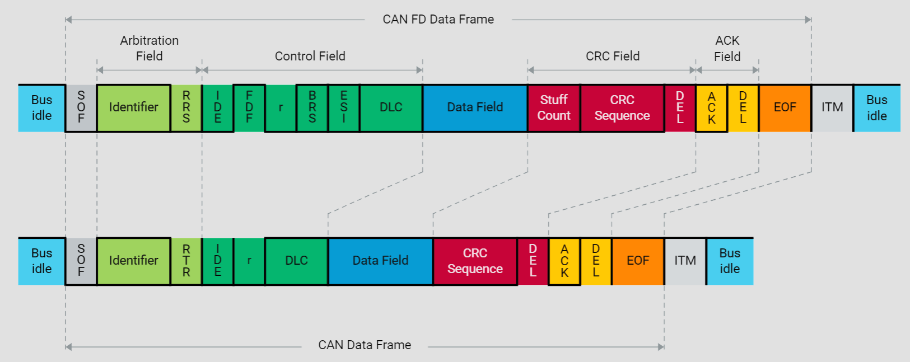
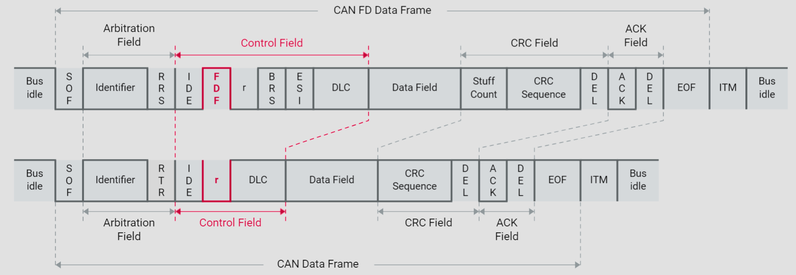
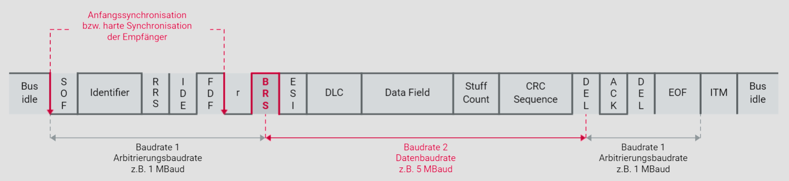
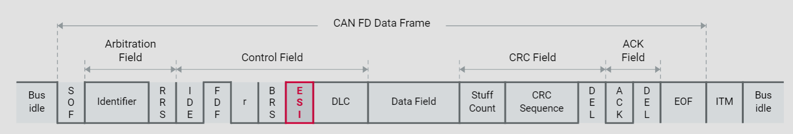
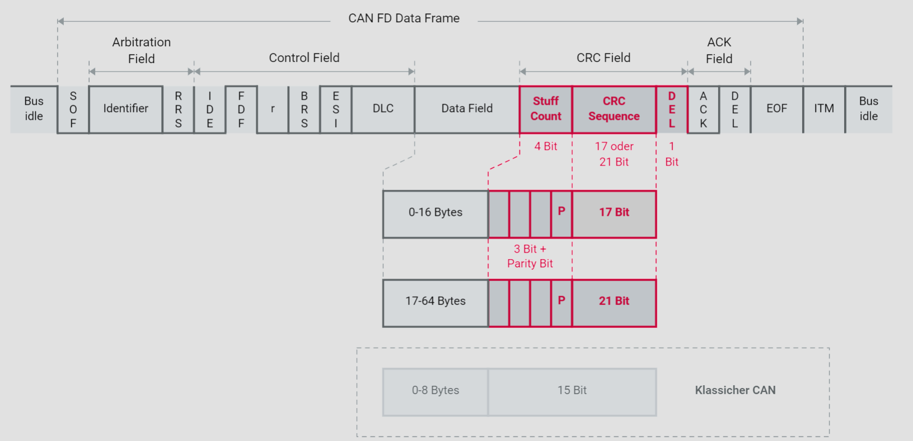
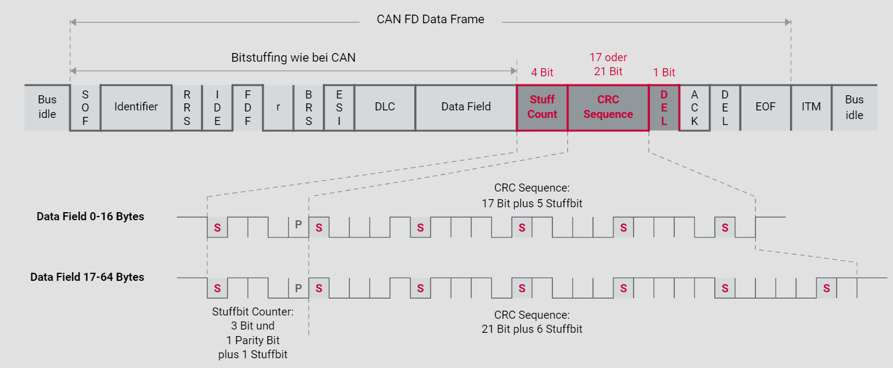

# 6. CAN FD

## 6.1. Motivation für CAN FD

In den Jahrzehnten seit Einführung des CAN-Busses hat sich das Gefüge von eingebetteten Systemen in Fahrzeugen stark verändert. Die wohl größte Veränderung liegt auf der quantitativen Seite: Gab es zur Zeit der Einführung von CAN einige hundert Signale, die innerhalb eines Fahrzeugs kommuniziert werden mussten, bewegt sich deren Anzahl heute im fünfstelligen Bereich.

Durch das anwachsende Datenaufkommen ergeben sich immer höhere Buslasten auf den CAN-Bussen. Neben den gestiegenen Bandbreitenanforderungen, hat auch der Bedarf an deterministischem Systemverhalten zur Entwicklung neuer Bussysteme geführt. So wurde für das Infotainment der MOST Bus entwickelt, mit Bandbreiten bis zu 150 Mbit/s. Das deterministische FlexRay Bussystem bietet bis zu 10 Mbit/s für Aufgaben im Fahrerassistenzbereich. Auf der anderen Seite der Bandbreitenskala wurde LIN eingeführt, um einfache Tätigkeiten im Sensor-Aktor-Bereich kostengünstiger zu bewältigen. Die neuen, maßgeschneiderten Bussysteme besetzen Nischen. Der vergleichsweise universal einsetzbare CAN-Bus ist bis heute das beherrschende Bussystem in Kraftfahrzeugen.

CAN durch Bussysteme mit höheren Bandbreiten, wie z.B. FlexRay zu ersetzen, ist nur selten erforderlich. Dagegen sprechen die höheren Kosten für die Hardware, sowie auch der immense Entwicklungsaufwand für die Portierung auf eine neue Technologie.

Die Engpässe bei der Übertragungskapazität von CAN lassen sich meist durch eine größere Anzahl von eingesetzten CAN-Bussen umgehen. Der Trend zur Bus-Vermehrung führt allerdings zum verstärkten Einsatz von Gateways, welche Informationen über Bussystemgrenzen hinweg weiterreichen können.

Der begrenzende Faktor für die relativ geringe Übertragungskapazität eines CAN-Busses liegt in einer spezifischen Eigenschaft: Zu gewissen Zeiten einer Botschaftsübertragung sind mehrere Netzknoten gleichzeitig im Sendemodus. Das ist während der Arbitrierung am Beginn einer Botschaft möglich und während der Übertragung des Acknowledge-Bits an ihrem Ende immer der Fall. Die Dauer eines Bits darf somit nicht kürzer sein als die Ausbreitung des entsprechenden Spannungspegels zwischen zwei beliebigen Netzknoten dauert. Dabei ist die Ausbreitungszeit für den Hin- und Rückweg zu berücksichtigen. Ein konkretes Beispiel: Bei einem CAN-Bus von 40m Länge müssen die Bits so lange dauern, dass die daraus resultierende Datenrate nicht mehr als 1 Mbit/s betragen kann.

Zwischen der Arbitrierungsphase und dem Acknowledge-Bit einer CAN-Botschaft liegt jedoch ein Bereich, in welchem nur ein einziges Steuergerät sendet. In diesem Bereich gilt die Mindestdauer für Bits nicht. Wie wäre es, dachten sich Entwickler bei Bosch, wenn man diesen mittleren Bereich einer CAN-Botschaft mit erhöhter Geschwindigkeit übertragen würde? Man müsste nur zwischen einer kleinen Geschwindigkeit am Beginn und Ende der Botschaften und einer hohen Geschwindigkeit in ihrer Mitte umschalten können. Genau dies ist der Grundgedanke von CAN FD.

## 6.2. Vorteile und Konsequenzen

Überträgt man die Nutzdaten einer CAN-FD-Botschaft schneller, so verkürzt sich die Dauer der Busbelegung; die Buslast verringert sich. Wenn die Übertragungsdauer im gleichen Rahmen bleibt wie bei den klassischen CAN-Botschaften, könnten größere Datenmengen mit einer CAN-FD-Botschaft transportiert werden.

Werden zum Beispiel die Nutzdaten in einem CAN FD Frame mit einer fünffach höheren Geschwindigkeit übertragen, so bliebe der CAN FD Frame gegenüber einem herkömmlichen CAN Frame zeitlich annähernd gleich lang, obwohl er fünfmal mehr Nutzdaten enthielte. Ergo lassen sich bei dieser Konstellation bei vergleichbarer Buslast fünfmal mehr Daten übertragen.

Durch Einführung von CAN FD ergäben sich einige Freiheitsgrade bei der Entwicklung:

* Das Buslast-Problem würde stark entschärft
* Der Trend zur Vermehrung von CAN-Bussen würde enden, sich möglicherweise sogar umkehren
* Gateways könnten vereinfacht werden, teilweise sogar entfallen
* Weniger Segmentierung von Daten durch mehr Nutzdaten pro Botschaft
* Besseres Verhältnis von Nutzdaten zum Overhead durch weniger Botschaften
* Neue Controller notwendig

Um CAN FD zu betreiben, bedarf es allerdings neuer CAN FD Controller. Diese sind abwärtskompatibel und beherrschen auch das klassische CAN-Protokoll. Steuergeräte können Zug um Zug auf die neue CAN-FD-Technologie aufgerüstet werden. Allerdings kann nur das klassische CAN-Protokoll gelten solange noch klassische CAN Controller an der Kommunikation beteiligt sind.

Es sieht so aus, als ob erst dann höhere Übertragungsraten möglich sind, wenn alle Steuergeräte an einem CAN-Bus mit den neuen CAN FD Controllern ausgestattet sind. Dieser Eindruck ist jedoch nicht ganz richtig. Ist nur ein Teil der Steuergeräte CAN-FD-fähig, so gäbe es die Option, diejenigen Steuergeräte mit klassischen CAN Controllern mittels Partial Networking in den Schlafmodus zu versetzen. Die übrigen Steuergeräte würden dann via CAN FD schneller miteinander kommunizieren können. Diese Vorgehensweise ließe sich beispielsweise beim Fahrzeugservice für die Diagnose nutzen. Vorteilhaft ist das vor allem dann, wenn neue Software auf die Steuergeräte aufgespielt werden muss. Gerade dort sind höhere Datenraten wünschenswert, weil solche Prozesse oft Stunden dauern.

Ein weiterer Vorteil von CAN FD ist, dass es sich nicht um eine neue Technologie handelt. CAN FD ist eine Erweiterung des klassischen CAN-Protokolls. Das gesamte CAN-Wissen, der damit betrauten Personen, gilt weiterhin. Ebenso bleiben die erworbenen Erfahrungen, Fähig- und Fertigkeiten weiterhin aktuell. Der Wechsel von CAN zu CAN FD kann ohne große Fortbildungsmaßnahmen und ohne den Verlust des bisher Erreichten erfolgen.

## 6.3. Neue Botschaftsformate

Analog zum klassischen CAN-Protokoll, kennt auch CAN FD zwei Data-Frame-Formate: Standard Frames mit 11 Bit Identifier und Extended Frames mit 29 Bit Identifier. Damit ist gewährleistet, dass Zusatzprotokolle wie CANopen und SAE J1939 mit entsprechenden Anpassungen auch unter CAN FD weiterexistieren und die beschriebenen Vorteile nutzen können.

Für CAN FD wurde darauf verzichtet ein eigenes Format für Remote Frames einzuführen. Dies ist jedoch bei näherem Hinsehen keine Einschränkung. Wegen des fehlenden Datenfeldes wäre eine Erhöhung der Datenrate wirkungslos. Das CAN-FD-Protokoll erlaubt allerdings, CAN FD Data Frames mit klassischen CAN Remote Frames anzufordern.

## 6.4. Details der CAN FD Botschaft

Das Reserve Bit des klassischen CAN Frames wird als Indikator für CAN FD benutzt. Wird es dominant mit dem Wert 0 übertragen, folgt wie bisher ein CAN Frame. Enthält das Bit den rezessiven Wert 1, folgt ein CAN FD Frame.

Das Bit heißt nun FDF für Flexible Data Rate Format und eröffnet die Möglichkeit, ein viel größeres Datenfeld viel schneller zu übertragen. Die Signalisierung der tatsächlichen Datenfeldgröße sowie die Entscheidung, ob die Umschaltung auf eine höhere Datenrate erfolgt, folgen später im Frame.

## 6.5. CAN oder CAN FD, die Unterscheidung

CAN FD Controller können sowohl das klassische CAN wie auch die CAN FD Erweiterungen nutzen. Hingegen würden klassische CAN Controller beim Empfang von CAN-FD-Botschaften immer mit der Signalisierung eines Fehlers reagieren: Schon ein rezessives Bit auf der vermeintlichen r-Bit-Position würde als Regelverstoß angesehen. Der aus CAN-Sicht ungültige Wert würde durch das Senden eines Error Frames geahndet. An dieser Stelle wird klar, dass CAN-FD-Botschaften von klassischen CAN Controllern weder verstanden noch geduldet werden können.

## 6.6. Kompatibilität von CAN und CAN FD Controllern

CAN FD Controller können sowohl das klassische CAN wie auch die CAN FD Erweiterungen nutzen. Hingegen würden klassische CAN Controller beim Empfang von CAN-FD-Botschaften immer mit der Signalisierung eines Fehlers reagieren: Schon ein rezessives Bit auf der vermeintlichen r-Bit-Position würde als Regelverstoß angesehen. Der aus CAN-Sicht ungültige Wert würde durch das Senden eines Error Frames geahndet. An dieser Stelle wird klar, dass CAN-FD-Botschaften von klassischen CAN Controllern weder verstanden noch geduldet werden können.

## 6.7. Beschleunigte Übertragung

Nach einem Reserve-Bit r für zukünftige Erweiterungen des CAN-FD-Protokolls, folgt das Schalter-Bit namens Bit Rate Switch (BRS). Ist es dominant, verharrt die Übertragung auf der für Baudrate 1 konfigurierten Geschwindigkeit.

Ist das BRS rezessiv, wird der in der Grafik rot gekennzeichnete Bereich der Botschaft mit der höheren zweiten Baudrate übertragen. Für alle CAN FD-Controller sind diese zwei Baudraten einheitlich zu konfigurieren.

In der Grafik wird die zweite Baudrate mit 5 MBaud angegeben. Das entspricht einer Datenrate von 5 Mbit/s, da die Bits und deren physikalischen Repräsentanten, die Spannungspegel, von gleicher Dauer sind. Dieser Wert ist nicht aus der Luft gegriffen. Laborversuche haben gezeigt, dass die meisten Transceiver, die für das herkömmliche CAN verwendet werden, problemlos mit 5 Mbit/s zurechtkommen. Auch höhere Datenraten lassen sich mit geeigneten Transceivern realisieren. Man wird abwarten müssen, welche Geschwindigkeiten sich im elektromagnetisch rauen Umfeld echter Fahrzeuge realisieren lassen.

Die Umschaltung von Baudrate 1 nach Baudrate 2 geschieht am Sampling Point des BRS-Bits, die Umschaltung von Baudrate 2 zurück zur Baudrate 1 am Sampling Point des CRC-Delimiters, direkt vor dem Acknowledgement.

Damit die Empfänger trotz der hohen Übertragungsrate perfekt auf den Sender abgestimmt sind, wird unmittelbar vor der Beschleunigung eine zweite, harte Synchronisation vorgenommen.

## 6.8. Selbstanzeige bei zu häufigen Fehlern

DLC bei CAN: 9 mögliche Längen

Der Data Length Code (DLC) war bei CAN bereits vier Bit groß. Damit konnten alle neun möglichen Längen des Datenfelds angegeben werden, nämlich 0 bis 8 Bytes.

DLC bei CAN FD: weitere 7 Möglichkeiten

Nun werden die weiteren, bisher ungenutzten Werte des DLC, nämlich 9 bis 15 verwendet. Der lineare Zusammenhang zwischen DLC und Anzahl der Bytes im Datenfeld wird für DLC > 8 jedoch aufgegeben. Die folgende Tabelle zeigt die Bedeutung des DLC für die Größe des Datenfelds unter CAN und CAN FD:

Error State Indicator

An das Bit Rate Switch (BRS) schließt sich ein Bit namens Error State Indicator (ESI) an. Es ist dominant wenn sich der sendende Netzknoten im Zustand Error Active befindet. Ist der ESI rezessiv, so befindet sich der Sender im Zustand Error Passive.

Der Sinn dieses Bits ist, eine transparentere Fehlerverfolgung sowie ein einfacheres Netzwerk Management zu ermöglichen. Die Zustände der Netzknoten, Error Active bzw. Error Passive, werden über den gesamten Bus hinweg signalisiert.

## 6.9. Länge des Datenfelds

## 6.10. Mehr Daten bei gleichbleibender Sicherheit

Größeres CRC Feld für mehr Daten

Die Wahrscheinlichkeit von Bitfehlern in einer CAN-FD-Botschaft erhöht sich. Zum einen geschieht das wegen der kurzen Bitzeit, zum anderen wegen der sehr viel höheren Anzahl von Bits im Datenfeld. Dies muss mit mehr Redundanz in den Botschaften kompensiert werden. Andernfalls würde auch die Wahrscheinlichkeit ansteigen, dass Fehler von den Empfängern nicht bemerkt werden. CAN FD Frames mit Datenfeldern bis 16 Bytes benötigen 17 CRC-Bits. Noch größere Frames werden mit einer 21‑Bit‑Redundanz gesichert.

Die beiden Generatorpolynome sind **0x3685B** für CRC~17~ und **0x302899** für CRC ~21~ .

## 6.11. Geändertes Bitstuffing und CRC-Berechnung

Bitstuffing bei CAN

Bei CAN-Botschaften werden ab dem Start of Frame (SOF) bis zum Ende der Prüfsumme (CRC), Stuffbits eingefügt. Nach jeweils 5 gleichnamigen Bits wird ein komplementäres eingefügt. Die Stuffbits werden nicht in die Prüfsumme eingerechnet.

Bitstuffing bei CAN FD

Bei CAN FD werden, ebenso wie bisher, ab dem SOF Stuffbits eingefügt. Jedoch endet diese Regel nun mit Ende des Datenfeldes. Anschließend wird die Anzahl der bisher eingefügten Stuffbits (Modulo 8), plus ein Parity Bit eingefügt. Der sendende Knoten berechnet daraufhin die Prüfsumme **inklusive** der bis dahin eingefügten Stuffbits.

Stuffbits im CRC-Feld an festen Positionen

Der letzte Schritt ist das Bitstuffing des gesamten CRC-Feldes nach folgender Regel: Das CRC-Feld beginnt immer mit einem Stuffbit. Nach jeweils 4 weiteren CRC-Feld-Bits, egal ob gleichnamig oder nicht, folgt wiederum ein Stuffbit. Der Wert eines CRC-Stuffbits ist komplementär zu seinem Vorgängerbit.

Nach dem CRC-Feld werden, wie beim herkömmlichen CAN, keine Stuffbits mehr eingefügt.

