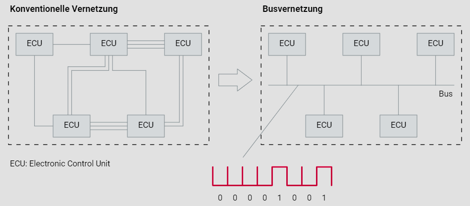

# Motivation für CAN

## Einleitung

Die jüngere Geschichte des Automobils ist durch eine intensive Elektronifizierung gekennzeichnet. Die treibende Kraft dafür geht in der Hauptsache von den immer anspruchsvolleren Wünschen der Kunden an ein modernes Automobil aus. Des Weiteren werden vom Gesetzgeber immer strengere Vorgaben zur Abgasemission gemacht. Aber auch die Globalisierung sorgt durch gestiegenen Wettbewerbs- und Kostendruck für stetigen Innovationsdruck.

## Datenaustausch zwischen Steuergeräten

Zu Beginn der Elektronifizierung reichten autonom arbeitende elektronische Steuergeräte (ECUs - Electronic Control Units) aus, um verschiedene Funktionen im Fahrzeug zu steuern. Jedoch wurde früh erkannt, dass die Koordination dieser Steuergeräte die Fahrzeugfunktionalität erheblich steigern kann. Der initiale Datenaustausch zwischen den Steuergeräten wurde konventionell realisiert, was bedeutete, dass jedem zu übertragenden Signal ein physikalischer Kommunikationskanal zugeordnet wurde. Dies führte zu einer komplexen und umfangreichen Verkabelung.

## Probleme der konventionellen Vernetzung

Die konventionelle Vernetzung, wie im linken Teil des Bildes dargestellt, zeigt eine direkte Punkt-zu-Punkt-Verbindung zwischen den Steuergeräten. Diese Methode hat mehrere Nachteile:

1. **Hoher Verkabelungsaufwand:** Jede Verbindung erfordert separate Kabel, was die Menge der benötigten Kabel erhöht.
2. **Eingeschränkte Erweiterbarkeit:** Das Hinzufügen neuer Steuergeräte oder Funktionen führt zu einer exponentiellen Zunahme der Verkabelung.
3. **Gewicht und Platzbedarf:** Die Vielzahl an Kabeln erhöht das Fahrzeuggewicht und beansprucht wertvollen Raum.

Das obige Bild veranschaulicht den Unterschied zwischen konventioneller Vernetzung und Busvernetzung. Links sind mehrere ECUs direkt miteinander verbunden, was eine aufwendige und unübersichtliche Verkabelung darstellt. Rechts hingegen sind die ECUs über einen gemeinsamen Bus verbunden, was die Verkabelung erheblich vereinfacht und effizienter macht. Darunter ist ein Signalverlauf dargestellt, der die bitserielle Datenübertragung im CAN-Bus symbolisiert.

## Einführung des seriellen Kommunikationssystems

Um den Verkabelungsaufwand zu reduzieren und die Datenkommunikation zu optimieren, wurde ein serielles Kommunikationssystem entwickelt. Der bitserielle Austausch von Daten über einen einzigen Kommunikationskanal (Bus) wurde als Lösung identifiziert. Dies erforderte die Entwicklung eines spezifischen seriellen Kommunikationssystems für Automobile.

## CAN (Controller Area Network)

In den frühen 1980er Jahren begann Bosch mit der Entwicklung des CAN-Bus-Systems. CAN ist darauf ausgelegt, eine sichere und zuverlässige Datenübertragung zu gewährleisten, die den Echtzeitanforderungen von Anwendungen im Automobil gerecht wird. Noch heute ist CAN ein unverzichtbarer Bestandteil der Vernetzung von Steuergeräten im Antrieb, Fahrwerk und Komfortbereich.

## Vorteile des CAN-Bus-Systems

Die Einführung des CAN-Bus-Systems, wie im rechten Teil des Bildes dargestellt, bietet zahlreiche Vorteile:

1. **Reduzierter Verkabelungsaufwand:** Ein einziger Bus kann von mehreren Steuergeräten gemeinsam genutzt werden, was die Anzahl der benötigten Kabel drastisch reduziert.
2. **Erhöhte Flexibilität:** Neue Steuergeräte können einfach an den bestehenden Bus angeschlossen werden, was die Erweiterbarkeit erleichtert.
3. **Gewichts- und Platzersparnis:** Weniger Kabel bedeuten geringeres Gewicht und mehr Platz für andere Komponenten.
4. **Sichere Übertragung:** CAN zeichnet sich durch eine sehr zuverlässige und sichere Datenübertragung aus, die für Echtzeitanwendungen geeignet ist.

## Fazit

Die Elektronifizierung des Automobils hat durch die Einführung des CAN-Bus-Systems erhebliche Fortschritte gemacht. Die komplexen und umfangreichen Kabelbäume der konventionellen Vernetzung gehören der Vergangenheit an. CAN vereinfacht nicht nur die Projektierung und Installation, sondern trägt auch zur Reduktion des Gewichts und Platzbedarfs der Verkabelung bei. Dies spiegelt die kontinuierliche Innovationskraft und Anpassungsfähigkeit der Automobilindustrie wider, um den steigenden Anforderungen und regulatorischen Vorgaben gerecht zu werden.
