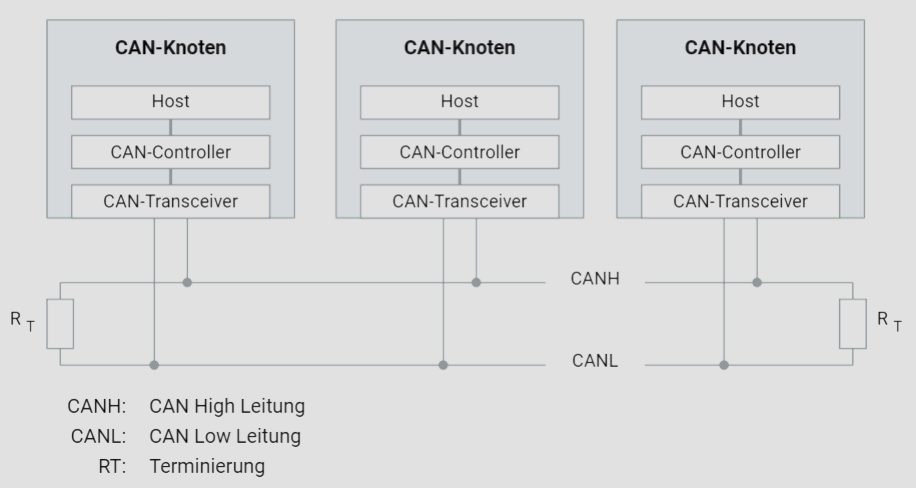

# CAN-Controller

## Einführung in das CAN-Netzwerk

Das Controller Area Network (CAN) ist ein robustes Fahrzeugbus-Standard, der es Mikrocontrollern und Geräten ermöglicht, ohne Host-Computer miteinander zu kommunizieren.

### Aufbau eines CAN-Netzwerks

In einem CAN-Netzwerk, wie in der unteren Grafik dargestellt, bestehen die grundlegenden Komponenten aus mehreren CAN-Knoten, die jeweils aus einem Host, einem CAN-Controller und einem CAN-Transceiver bestehen. Die Knoten sind über die beiden Leitungen CANH (CAN High) und CANL (CAN Low) miteinander verbunden. An beiden Enden des CAN-Busses befindet sich jeweils ein Terminierungswiderstand \( R_T \), der für die korrekte Funktion des Netzwerks notwendig ist.

### Komponenten eines CAN-Knotens

#### CAN-Controller

Der CAN-Controller übernimmt die Kommunikationsaufgaben gemäß dem CAN-Protokoll und entlastet dadurch den Host. Er ist verantwortlich für das Senden und Empfangen von Nachrichten, das Erkennen von Fehlern und das Gewährleisten der Datensicherheit und -integrität.

#### CAN-Transceiver

Der CAN-Transceiver verbindet den CAN-Controller mit dem physikalischen Übertragungsmedium. Üblicherweise sind der CAN-Controller und der CAN-Transceiver galvanisch getrennt, oft mittels Optokoppler, um Überspannungsschäden zu verhindern. Diese Trennung schützt den Host und den CAN-Controller vor Beschädigungen durch Überspannungen auf dem CAN-Bus.

### Kommunikation im CAN-Netzwerk

In einem CAN-Netzwerk können die Anzahl der zu sendenden und empfangenden Nachrichten sowie deren Frequenzen stark variieren. Ein Knoten könnte beispielsweise fünf verschiedene Nachrichten in einem Zyklus von zehn Millisekunden empfangen, während ein anderer Knoten alle 100 Millisekunden nur eine Nachricht empfängt. Diese Unterschiede haben zur Entwicklung von zwei grundlegenden CAN-Controller-Architekturen geführt:

1. **CAN-Controller mit Objektespeicherung**: Diese Architektur speichert Nachrichten in einer internen Queue, wodurch eine effiziente Handhabung von Nachrichten mit hoher Frequenz ermöglicht wird.
2. **CAN-Controller ohne Objektespeicherung**: Diese Architektur ist einfacher und eignet sich für Anwendungen mit geringeren Kommunikationsanforderungen.

### Integration von CAN-Controllern

CAN-Controller können entweder als integrierte oder eigenständige Bausteine (stand-alone) verwendet werden. Bei der Stand-Alone-Variante behandelt der Mikrocontroller den CAN-Controller wie einen Speicherbaustein, was größere Flexibilität bietet. Die On-Chip-Variante nimmt weniger Platz in Anspruch und ermöglicht eine schnellere und zuverlässigere Kommunikation zwischen Mikrocontroller und CAN-Controller.

### Terminierung des CAN-Busses

Die Terminierung des CAN-Busses erfolgt durch Widerstände an den beiden Enden der CAN-Leitungen. Diese Terminierungswiderstände \( R_T \) verhindern Signalreflexionen, die zu Kommunikationsstörungen führen könnten. In der obigen Grafik sind diese Widerstände am Anfang und Ende des Busses dargestellt.

### Fazit

Das Verständnis der Architektur und der Funktionsweise eines CAN-Netzwerks ist essenziell für die Entwicklung und Wartung moderner Fahrzeugsysteme. Die richtige Integration und Konfiguration der CAN-Controller und Transceiver sowie die korrekte Terminierung des Busses sind entscheidend für die Zuverlässigkeit und Effizienz der Kommunikation im Fahrzeug.
