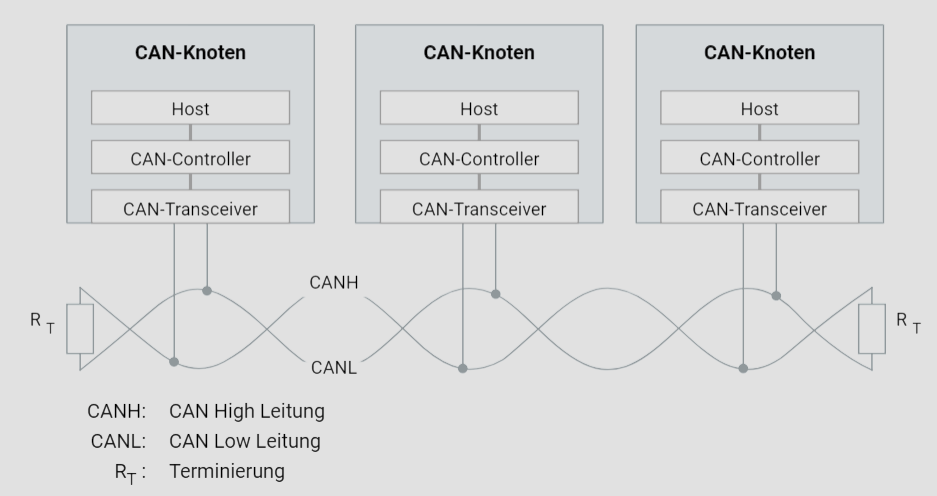

# CAN-Bus

## Einleitung

Die CAN-Kommunikation (Controller Area Network) ist ein weit verbreitetes Netzwerkprotokoll in der Automobilindustrie, das eine robuste und effiziente Datenübertragung zwischen verschiedenen Steuergeräten ermöglicht. Dieses Tutorial bietet eine detaillierte Übersicht über die physikalische Signalübertragung in einem CAN-Netzwerk und erläutert die wesentlichen Komponenten und Prinzipien.

### Differenzsignalübertragung

Die physikalische Signalübertragung in einem CAN-Netzwerk basiert auf der Übertragung von Spannungsdifferenzen, auch bekannt als Differenzsignalübertragung. Diese Methode minimiert die Auswirkungen von elektromagnetischen Störungen, die durch Motoren, Zündanlagen und Schaltkontakte induziert werden können. In einem CAN-Bus bestehen die Übertragungsleitungen aus zwei separaten Leitungen: der CAN-High-Leitung (CANH) und der CAN-Low-Leitung (CANL). Der Unterschied in den Spannungen zwischen diesen beiden Leitungen trägt die Information, wodurch das System resistenter gegen Störsignale wird.

### Verdrillte Leiterpaare

Die Verwendung von verdrillten Leiterpaaren ist eine gängige Praxis in der CAN-Kommunikation. Das Verdrillen der beiden Leitungen (CANH und CANL) reduziert das erzeugte magnetische Feld erheblich, was wiederum die elektromagnetische Störanfälligkeit senkt. In der Praxis wird daher als physikalisches Übertragungsmedium in der Regel ein verdrilltes Leiterpaar (Twisted Pair) verwendet.

### Abschlusswiderstände

Abschlusswiderstände spielen eine entscheidende Rolle bei der Vermeidung von Signalreflexionen, die durch die finite Signalausbreitungsgeschwindigkeit verursacht werden. Diese Reflexionen können bei hohen Datenraten oder langen Busausdehnungen problematisch werden. Durch die Terminierung der Enden des Kommunikationskanals mit Abschlusswiderständen wird eine Nachbildung der elektrischen Eigenschaften des Übertragungsmediums erreicht, was Reflexionen in einem CAN-High-Speed-Netzwerk effektiv verhindert.

Der Abschlusswiderstand muss dem Wellenwiderstand der elektrischen Leitung entsprechen, der in der Regel 120 Ohm beträgt. Während die ISO 11898-2 Norm für High-Speed-CAN-Netzwerke diesen Widerstand vorschreibt, ist dies bei der ISO 11898-3 Norm für Low-Speed-CAN-Netzwerke aufgrund der geringeren maximalen Datenrate von 125 KBit/s nicht erforderlich.

### Aufbau eines CAN-Knotens

Ein typischer CAN-Knoten besteht aus folgenden Komponenten:

- **Host**: Dies ist die zentrale Verarbeitungseinheit, die die Steuerlogik und Datenverarbeitung durchführt.
- **CAN-Controller**: Der Controller formatiert die zu sendenden Nachrichten und verarbeitet empfangene Nachrichten.
- **CAN-Transceiver**: Der Transceiver wandelt die vom Controller kommenden digitalen Signale in differenzielle Signale um, die über das physikalische Medium übertragen werden, und umgekehrt.

Das dargestellte Diagramm zeigt ein typisches CAN-Netzwerk mit drei CAN-Knoten. Jeder Knoten besteht aus einem Host, einem CAN-Controller und einem CAN-Transceiver. Die CAN-High- (CANH) und CAN-Low-Leitungen (CANL) sind als verdrillte Leiterpaare dargestellt, die die Störanfälligkeit minimieren. An den Enden des Busses befinden sich Abschlusswiderstände (RT) mit einem Wert von 120 Ohm, um Reflexionen zu verhindern.

### Fazit

Ein tiefes Verständnis der physikalischen Prinzipien der CAN-Kommunikation, einschließlich der Differenzsignalübertragung, der Verwendung verdrillter Leiterpaare und der Rolle von Abschlusswiderständen, ist essenziell für die Entwicklung zuverlässiger und effizienter Netzwerke in der Automobilindustrie. Dieses Tutorial hat die wesentlichen Aspekte dieser Technologie beleuchtet und bietet eine solide Grundlage für weiterführende Studien und Anwendungen im Bereich der Fahrzeug-Elektronik.
