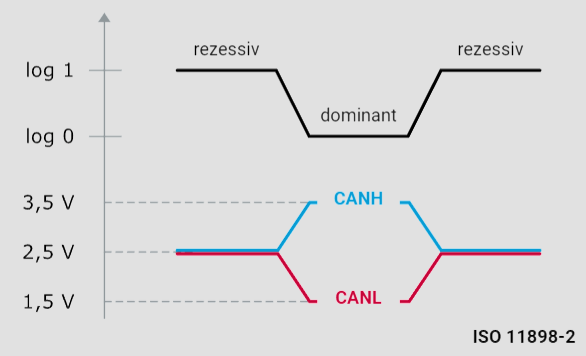
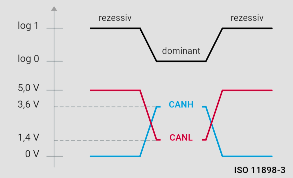

# Busankopplung

Die physikalische Signalübertragung in einem CAN-Netzwerk basiert auf der Differenzsignalübertragung. Die Differenzspannungen hängen von der eingesetzten Busankopplung ab. Man unterscheidet zwischen der CAN-Highspeed-Busankopplung (ISO 11898-2) und der CAN-Lowspeed-Busankopplung (ISO 11898-3).

## Spannungsverhältnisse

Die **ISO 11898-2** weist der logischen 1 eine typische Differenzspannung von 0 Volt zu. Der logischen 0 wird eine typische Differenzspannung von 2 Volt zugewiesen. CAN-Highspeed-Transceiver deuten innerhalb des Gleichtaktarbeitsbereichs, der üblicherweise zwischen 12 Volt und -12 Volt liegt, eine Differenzspannung von mehr als 0,9 Volt als dominanten Pegel. Unterhalb von 0,5 Volt dagegen wird die Differenzspannung als rezessiver Pegel gedeutet. Eine Hysterese-Schaltung erhöht die Immunität gegenüber Störspannungen.

Die **ISO 11898-3** weist der logischen 1 eine typische Differenzspannung von 5 Volt zu, der logischen 0 eine typische Differenzspannung von 2 Volt.

### CAN-Highspeed-Buspegel (ISO 11898-2)

Die Grafik "CAN-Highspeed-Buspegel" zeigt die unterschiedlichen Spannungsverhältnisse auf dem CAN-Bus für Highspeed-Anwendungen. Bei der Highspeed-Busankopplung bewegen sich die Spannungen für CANH (CAN High) und CANL (CAN Low) wie folgt:

- **Rezessiver Zustand (logische 1)**: CANH und CANL haben beide eine Spannung von etwa 2,5 Volt.
- **Dominanter Zustand (logische 0)**: CANH hat eine Spannung von etwa 3,5 Volt und CANL eine Spannung von etwa 1,5 Volt.

Diese Differenz von 2 Volt wird als dominanter Pegel erkannt, während eine Differenz von 0 Volt als rezessiver Pegel erkannt wird.

### CAN-Lowspeed-Buspegel (ISO 11898-3)

Die Grafik "CAN-Lowspeed-Buspegel" zeigt die unterschiedlichen Spannungsverhältnisse auf dem CAN-Bus für Lowspeed-Anwendungen. Bei der Lowspeed-Busankopplung bewegen sich die Spannungen für CANH und CANL wie folgt:

- **Rezessiver Zustand (logische 1)**: CANH hat eine Spannung von etwa 0 Volt und CANL hat eine Spannung von etwa 5 Volt.
- **Dominanter Zustand (logische 0)**: CANH hat eine Spannung von etwa 3,6 Volt und CANL eine Spannung von etwa 1,4 Volt.

Auch hier ergibt sich eine Differenz von 2 Volt für den dominanten Pegel, während eine Differenz von 5 Volt als rezessiver Pegel erkannt wird.

## Fazit

Die Spannungsverhältnisse und die Unterscheidung zwischen dominanten und rezessiven Pegeln sind entscheidend für die korrekte Funktion eines CAN-Busses. Die unterschiedlichen Normen ISO 11898-2 und ISO 11898-3 definieren spezifische Spannungsbereiche für Highspeed- und Lowspeed-Anwendungen. Ein tiefes Verständnis dieser Spezifikationen ist essentiell für die Entwicklung und Fehlerdiagnose in Fahrzeugnetzwerken.
