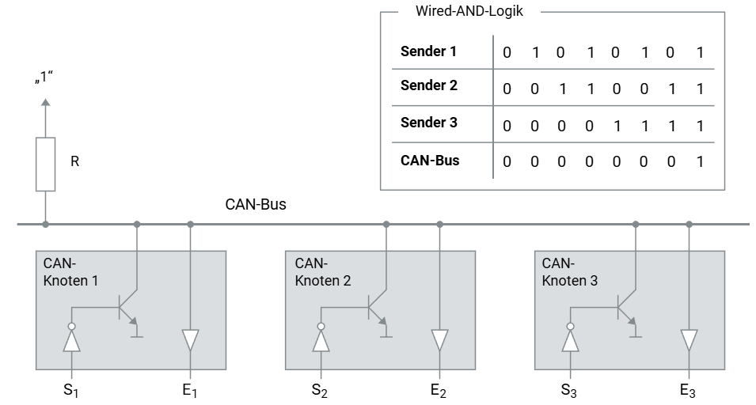

# CAN-Buslogik im Fahrzeug

Der Controller Area Network (CAN) Bus ist ein robustes Fahrzeugnetzwerk, das es Mikrocontrollern und Geräten ermöglicht, ohne einen Host-Computer direkt miteinander zu kommunizieren. CAN-Busse sind in der Automobilindustrie weit verbreitet und werden für verschiedene elektronische Steuergeräte (ECUs) genutzt. Ein tiefes Verständnis der CAN-Buslogik ist entscheidend für die Diagnose und das Design von Fahrzeugnetzen. Diese Anleitung gibt eine detaillierte Erklärung der CAN-Buslogik basierend auf den bereitgestellten Informationen und Abbildungen.

## Dominanter und Rezessiver Buspegel

In einem CAN-Netzwerk ist die Unterscheidung zwischen dominantem und rezessivem Buspegel entscheidend:

- **Dominanter Buspegel:** Entspricht der logischen "0".
- **Rezessiver Buspegel:** Entspricht der logischen "1".

Ein dominanter Pegel überschreibt immer einen rezessiven Pegel. Das bedeutet, wenn verschiedene CAN-Knoten gleichzeitig dominante und rezessive Pegel senden, nimmt der CAN-Bus den dominanten Pegel an. Nur wenn alle CAN-Knoten einen rezessiven Pegel senden, wird dieser auf dem Bus aktiv.

## UND-Logik

Dieses Verhalten entspricht einer UND-Logik, die physikalisch durch eine Open-Collector-Schaltung realisiert wird. Die Open-Collector-Ausgänge der CAN-Knoten sind miteinander verbunden und arbeiten nach dem Prinzip, dass der Buspegel "0" (dominant) ist, sobald ein Knoten diesen Pegel sendet.

Die Abbildung zeigt drei CAN-Knoten (Knoten 1, Knoten 2 und Knoten 3), die jeweils mit dem CAN-Bus verbunden sind. Jeder Knoten kann entweder einen dominanten oder einen rezessiven Pegel senden. Die Tabelle neben der Abbildung zeigt die Logik der gesendeten Pegel und deren Ergebnis auf dem CAN-Bus.

- **Sender 1, 2 und 3:** Diese repräsentieren die Signale der drei Knoten. Jeder Knoten kann ein Bit senden, das entweder 0 (dominant) oder 1 (rezessiv) ist.
- **CAN-Bus:** Der kombinierte Pegel auf dem Bus, der durch die dominante Logik der Open-Collector-Schaltung bestimmt wird.

## Funktionsweise der Schaltung

1. **Initialzustand:** Der Widerstand R zieht den Bus auf den rezessiven Pegel "1", wenn keine Knoten senden.
2. **Senden eines dominanten Pegels:** Wenn ein Knoten einen dominanten Pegel "0" sendet, zieht er den Bus auf diesen Pegel, unabhängig davon, was die anderen Knoten senden.
3. **Rezessiver Pegel:** Der Bus bleibt nur dann auf dem rezessiven Pegel "1", wenn alle Knoten rezessiv senden.

# Verständnis der Wired-AND-Buslogik

Die Open-Collector-Schaltung ermöglicht eine effektive Realisierung der Wired-AND-Logik. Die Tabelle in der Abbildung zeigt verschiedene Szenarien, in denen die Kombination der gesendeten Pegel durch die Knoten das Ergebnis auf dem CAN-Bus beeinflusst.

Beispiel:

- **Sender 1:** 0 1 0 1 0 1 0 1
- **Sender 2:** 0 0 1 1 0 1 1 1
- **Sender 3:** 0 0 0 1 1 1 1 1
- **CAN-Bus:** 0 0 0 0 0 1 0 1

Hier zeigt sich, dass der CAN-Bus nur dann "1" (rezessiv) ist, wenn alle Sender diesen Pegel senden.

## Anwendung in Fahrzeugen

Diese Logik ermöglicht eine zuverlässige Kommunikation und Fehlererkennung in Fahrzeugen. Jeder Knoten kann den Zustand des Busses überwachen und feststellen, ob sein gesendetes Signal korrekt übertragen wird. Falls ein dominantes Signal gesendet wird und ein rezessiver Pegel gelesen wird, erkennt der Knoten eine Kollision und kann entsprechend reagieren.

# Fazit

Das Verständnis der CAN-Buslogik und der Wired-AND-Logik ist essenziell für das Design und die Diagnose von Fahrzeugnetzwerken. Die Open-Collector-Schaltung stellt sicher, dass der dominante Pegel Vorrang hat und ermöglicht so eine zuverlässige Kommunikation zwischen den verschiedenen Steuergeräten im Fahrzeug.
