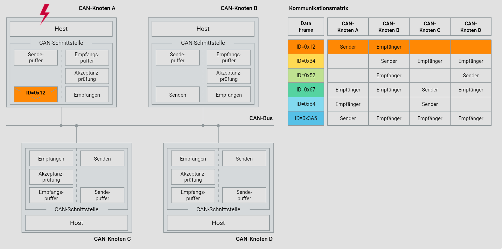

# CAN-Kommunikationsprinzips im Fahrzeug

Im Folgenden wird das CAN-Kommunikationsprinzip im Detail erklärt. Das Ziel ist es, ein tiefes Verständnis der Struktur und Funktionsweise eines CAN-Netzwerks im Fahrzeug zu vermitteln. Dabei wird besonders auf die Aspekte der Dezentralisierung, Ereignisorientierung und empfängerselektiven Adressierung eingegangen. Zusätzlich wird die Kommunikationsmatrix ausführlich behandelt, um die komplexen Interaktionen zwischen den CAN-Knoten zu verdeutlichen.

## 1. Dezentralisierung

In sicherheitskritischen Anwendungen, wie dem Antriebsstrang eines Fahrzeugs, ist eine hohe Verfügbarkeit des Kommunikationssystems unerlässlich. Die Dezentralisierung des Buszugriffs spielt hierbei eine entscheidende Rolle.

### Vorteile der Dezentralisierung

- **Erhöhte Redundanz**: Jeder CAN-Knoten besitzt das Recht, auf den Bus zuzugreifen. Dies bedeutet, dass der Ausfall eines einzelnen Knoten nicht den Ausfall des gesamten Systems zur Folge hat.
- **Lastverteilung**: Die Verteilung der Kommunikationslast auf mehrere Knoten verhindert die Überlastung einzelner Komponenten und sorgt für eine gleichmäßige Auslastung des Systems.
- **Ausfallsicherheit**: Durch die Dezentralisierung wird die Ausfallsicherheit des Netzwerks erhöht, da kein einzelner Punkt als Schwachstelle existiert.

## 2. Ereignisorientierung

Ein CAN-Netzwerk verwendet eine ereignisorientierte Kommunikationsstrategie, die es ermöglicht, effizient und schnell auf Änderungen zu reagieren. Dies unterscheidet sich grundlegend von zeitgesteuerten Systemen, bei denen Nachrichten in festen Intervallen gesendet werden.

### Merkmale der ereignisorientierten Kommunikation

- **Asynchrone Datenübertragung**: Nachrichten werden nur gesendet, wenn Ereignisse dies erfordern. Dies reduziert die unnötige Belastung des Netzwerks.
- **Hohe Reaktionsgeschwindigkeit**: CAN-Netzwerke können auf Ereignisse in Echtzeit reagieren, was besonders für sicherheitskritische Anwendungen wichtig ist.
- **Effiziente Bandbreitennutzung**: Die Übertragungskapazität wird optimal genutzt, da nur relevante Daten gesendet werden.

### Beispiel

Ein Sensor in einem Fahrzeug detektiert eine plötzliche Bremsung und sendet sofort eine entsprechende Nachricht an das Steuergerät. Da das Netzwerk ereignisorientiert arbeitet, wird die Nachricht umgehend verarbeitet und die erforderlichen Maßnahmen werden eingeleitet.

## 3. Empfängerselektive Adressierung

Um eine flexible und skalierbare Netzwerkkonfiguration zu ermöglichen, verwendet das CAN-System eine empfängerselektive Adressierung. Dies bedeutet, dass jede Nachricht von jedem Knoten empfangen werden kann, aber nur die relevanten Knoten die Nachricht weiterverarbeiten.

### Funktionsweise

- **Botschaftskennung (Identifier)**: Jede CAN-Nachricht ist mit einer eindeutigen Kennung versehen. Diese Kennung dient zur Identifizierung der Nachricht und zur Steuerung der Priorität bei der Busarbitrierung.
- **Filterung**: Jeder CAN-Knoten verfügt über Filter, die bestimmen, welche Nachrichten weiterverarbeitet werden sollen. Diese Filter werden individuell konfiguriert und ermöglichen eine zielgerichtete Datenverarbeitung.

### Vorteile

- **Flexibilität**: Neue Knoten können problemlos in das Netzwerk integriert werden, ohne bestehende Knoten oder die Netzwerkkonfiguration ändern zu müssen.
- **Reduzierung der Buslast**: Durch die Filterung werden nur relevante Nachrichten weiterverarbeitet, was die Effizienz des Netzwerks erhöht.

## 4. Kommunikationsmatrix im CAN-Netzwerk

Die Kommunikationsmatrix ist ein zentrales Element zur Planung und Analyse der Datenströme innerhalb eines CAN-Netzwerks. Sie definiert, welcher Knoten welche Nachrichten sendet und empfängt.

### Aufbau der Kommunikationsmatrix

- **Datenrahmen (IDs)**: Jede Zeile in der Matrix repräsentiert einen Datenrahmen mit einer spezifischen Kennung.
- **Knoten**: Die Spalten repräsentieren die verschiedenen CAN-Knoten im Netzwerk.
- **Sendende und empfangende Knoten**: Die Matrixeinträge zeigen an, welcher Knoten als Sender und welcher als Empfänger fungiert.

### Beispielhafte Kommunikationsmatrix

| Data Frame | CAN-Knoten A | CAN-Knoten B | CAN-Knoten C | CAN-Knoten D |
| ---------- | ------------ | ------------ | ------------ | ------------ |
| ID=0x12    | Sender       | Empfänger   |              |              |
| ID=0x34    |              | Sender       | Empfänger   | Empfänger   |
| ID=0x52    |              |              | Empfänger   | Sender       |
| ID=0x67    | Empfänger   | Empfänger   | Sender       | Empfänger   |
| ID=0xB4    | Empfänger   |              | Sender       |              |
| ID=0x3A5   | Sender       | Empfänger   | Empfänger   | Empfänger   |

### Interpretation der Matrix

- **ID=0x12**: Knoten A sendet, Knoten B empfängt.
- **ID=0x34**: Knoten B sendet, Knoten C und D empfangen.
- **ID=0x52**: Knoten D sendet, Knoten C empfängt.
- **ID=0x67**: Knoten C sendet, Knoten A, B und D empfangen.
- **ID=0xB4**: Knoten C sendet, Knoten A empfängt.
- **ID=0x3A5**: Knoten A sendet, Knoten B, C und D empfangen.

Diese Matrix ermöglicht eine klare und strukturierte Übersicht über die Kommunikationswege im Netzwerk und unterstützt bei der Planung und Fehlersuche.

## 5. Funktionsweise der CAN-Kommunikation

### Struktur eines CAN-Knotens

Jeder CAN-Knoten besteht aus einem Host und einer CAN-Schnittstelle, die verschiedene Komponenten enthält:

1. **Sendepuffer**: Speichert die zu sendenden Nachrichten.
2. **Empfangspuffer**: Speichert die empfangenen Nachrichten.
3. **Akzeptanzprüfung**: Prüft, ob eine empfangene Nachricht für den Knoten bestimmt ist.
4. **Senden und Empfangen**: Über die CAN-Schnittstelle werden Nachrichten gesendet und empfangen.

---

---

### Kommunikationsablauf

1. **Nachricht senden**: Der Host legt eine Nachricht in den Sendepuffer.
2. **Busarbitrierung**: Der CAN-Controller prüft die Busverfügbarkeit und führt eine Prioritätsarbitrierung durch.
3. **Nachricht empfangen**: Empfänger-Knoten prüfen anhand der Kennung und Filter, ob die Nachricht relevant ist und legen sie im Empfangspuffer ab.
4. **Nachrichtenverarbeitung**: Der Host des Empfänger-Knotens verarbeitet die empfangene Nachricht weiter.

## 6. Praxisbeispiel

Stellen Sie sich vor, ein modernes Fahrzeug verfügt über mehrere Steuergeräte, die über ein CAN-Netzwerk verbunden sind. Jedes Steuergerät (ECU) ist ein CAN-Knoten und kommuniziert mit anderen Knoten, um verschiedene Funktionen zu steuern:

- **Motorsteuergerät (ECU A)**: Sendet Daten über Motordrehzahl (ID=0x12).
- **Getriebesteuergerät (ECU B)**: Empfängt Motordrehzahldaten und sendet Ganginformationen (ID=0x34).
- **ABS-Steuergerät (ECU C)**: Empfängt Daten von beiden Steuergeräten und sendet Bremsinformationen (ID=0x67).

### Kommunikationsmatrix für das Fahrzeug

| Data Frame | Motorsteuergerät | Getriebesteuergerät | ABS-Steuergerät |
| ---------- | ----------------- | -------------------- | ---------------- |
| ID=0x12    | Sender            | Empfänger           |                  |
| ID=0x34    |                   | Sender               | Empfänger       |
| ID=0x67    |                   | Empfänger           | Sender           |

Dieses Beispiel zeigt, wie die verschiedenen Steuergeräte im Fahrzeug über ein CAN-Netzwerk interagieren und Informationen austauschen.

## Fazit

Ein CAN-Netzwerk im Fahrzeug bietet eine zuverlässige und flexible Kommunikationsplattform für sicherheitskritische Anwendungen. Durch die Dezentralisierung des Buszugriffs, ereignisorientierte Datenübertragung und empfängerselektive Adressierung wird eine hohe Verfügbarkeit und Effizienz gewährleistet. Die Kommunikationsmatrix hilft bei der Planung und Verwaltung der Datenströme im Netzwerk und unterstützt bei der Integration neuer Knoten.
