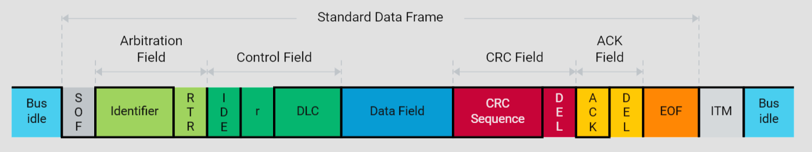
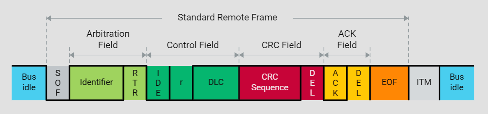
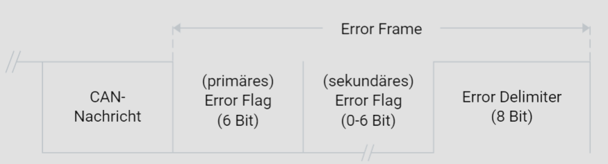

# CAN-Framing

## Data Frame

Zur Übertragung von Nutzdaten sieht die ISO 11898-1 den sogenannten Data Frame vor. Ein Data Frame kann maximal acht Nutzbytes transportieren. Zur Verfügung steht dazu das sogenannte Data Field, welches eingerahmt ist von einer Vielzahl von Feldern, die zur Abwicklung des CAN-Kommunikationsprotokolls erforderlich sind. Diese Felder sind im Einzelnen:

- **Start of Frame (SOF):** Markiert den Beginn des Data Frames.
- **Identifier (ID):** Enthält die Botschaftsadresse, die zur Identifikation der Nachricht dient.
- **Remote Transmission Request (RTR):** Ein Bit, das den Unterschied zwischen einem Data Frame und einem Remote Frame signalisiert.
- **Identifier Extension (IDE):** Bestimmt, ob ein Standard- oder ein Extended-Identifier verwendet wird.
- **Reserved Bit (r):** Reservierte Bits, die für zukünftige Erweiterungen vorgesehen sind.
- **Data Length Code (DLC):** Gibt die Anzahl der Bytes im Data Field an.
- **Data Field:** Enthält die eigentlichen Nutzdaten (bis zu 8 Bytes).
- **Cyclic Redundancy Check Sequence (CRC Sequence):** Dient der Fehlererkennung innerhalb des Frames.
- **CRC Delimiter:** Trennt das CRC-Feld von den folgenden Feldern.
- **Acknowledgement Field (ACK):** Besteht aus dem ACK-Slot und dem ACK-Delimiter. Der Empfänger signalisiert hier, dass die Nachricht fehlerfrei empfangen wurde.
- **End of Frame (EOF):** Markiert das Ende des Data Frames.
- **Intermission (ITM):** Ein Intervall, das zwischen zwei aufeinanderfolgenden Nachrichten liegt.

Der Data Frame ist das Rückgrat der CAN-Kommunikation und ermöglicht die effiziente Übertragung von Daten zwischen den Knoten eines CAN-Netzwerks.

## Remote Frame

Während zur Übertragung von Data Frames die entsprechenden Informationserzeuger die Initiative ergreifen, existiert mit dem Remote Frame ein Frametyp, mit dem Nutzdaten, also Data Frames, von beliebigen CAN-Knoten angefordert werden können. Bis auf das fehlende Data Field setzt sich ein Remote Frame wie ein Data Frame zusammen. Die Felder sind wie folgt:

- **Start of Frame (SOF)**
- **Identifier (ID)**
- **Remote Transmission Request (RTR):** Dieses Bit ist im Remote Frame immer gesetzt.
- **Identifier Extension (IDE)**
- **Reserved Bit (r)**
- **Data Length Code (DLC)**
- **Cyclic Redundancy Check Sequence (CRC Sequence)**
- **CRC Delimiter**
- **Acknowledgement Field (ACK)**
- **End of Frame (EOF)**
- **Intermission (ITM)**

Der wesentliche Unterschied zum Data Frame besteht im Fehlen des Data Fields. Der Remote Frame dient dazu, einen anderen Knoten im Netzwerk zur Übertragung eines Data Frames aufzufordern.

## Error Frame

Der Error Frame steht zur Verfügung, um während des Kommunikationsbetriebs entdeckte Fehler zu signalisieren. Mit dem Übertragen eines Error Frames geht der Abbruch der laufenden Botschaftsübertragung einher. Der Aufbau eines Error Frames unterscheidet sich wesentlich vom Aufbau eines Data oder Remote Frames. Man kann lediglich zwei Felder voneinander unterscheiden:

- **Error Flag:** Das Error Flag signalisiert den Fehlerzustand. Es besteht aus sechs dominanten Bits, die von der Fehler entdeckenden Station gesendet werden.
- **Error Delimiter:** Dieses Feld besteht aus acht rezessiven Bits und markiert das Ende des Error Frames.

Ein Error Frame wird gesendet, wenn eine Station einen Fehler erkennt, und zwingt alle Stationen dazu, die fehlerhafte Nachricht zu verwerfen. Dies stellt sicher, dass keine fehlerhaften Daten im Netzwerk akzeptiert werden.

## Schlussfolgerung

Das Verständnis der verschiedenen CAN-Frame-Typen und ihrer Felder ist essenziell für die Implementierung und Fehlersuche in CAN-basierten Netzwerken. Jeder Frame-Typ erfüllt eine spezifische Rolle innerhalb des CAN-Kommunikationsprotokolls und trägt zur Robustheit und Zuverlässigkeit des Systems bei. Die präzise Kenntnis und Anwendung dieser Frames ermöglichen eine effiziente und fehlerfreie Datenkommunikation in modernen Fahrzeugnetzwerken.
