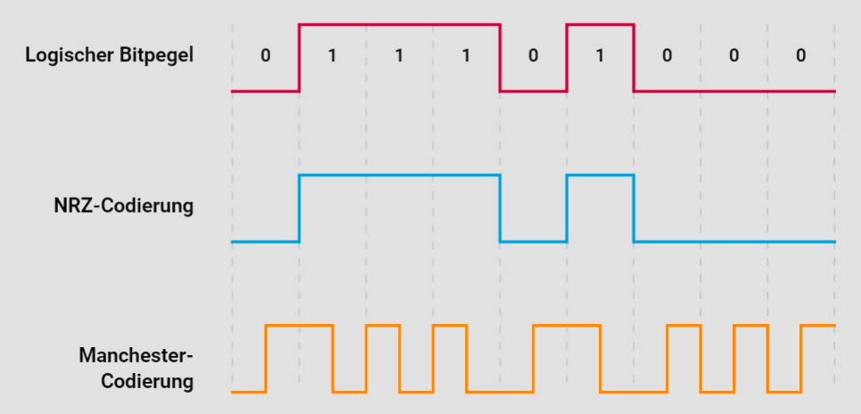

# Bitcodierung im CAN-Bus

In diesem Tutorial werden wir die Grundlagen der Bitcodierung im CAN-Bus (Controller Area Network) untersuchen, insbesondere die NRZ-Bitcodierung und deren Bedeutung für die Störfestigkeit und die Synchronisation.

## Einleitung

Die Bitcodierung spielt eine zentrale Rolle bei der Kommunikation in Fahrzeugnetzwerken, da sie sowohl die Übertragungseffizienz als auch die Störfestigkeit beeinflusst. Im Kontext des CAN-Bus, der in der Automobilindustrie weit verbreitet ist, wurde die NRZ-Bitcodierung (Non Return to Zero) gewählt. Wir werden die Gründe für diese Wahl und die damit verbundenen Herausforderungen im Detail beleuchten.

## NRZ-Bitcodierung

### Grundlagen der NRZ-Codierung

Die NRZ-Bitcodierung ist eine Methode zur Abbildung von Binärsignalen, bei der eine logische „1“ durch einen hohen Pegel und eine logische „0“ durch einen niedrigen Pegel dargestellt wird. Ein wesentliches Merkmal dieser Codierung ist, dass bei aufeinanderfolgenden Bits gleicher Polarität keine Pegeländerung stattfindet.

#### Vorteile der NRZ-Codierung
- **Hohe Datenraten**: Die NRZ-Codierung ermöglicht hohe Datenraten, da keine zusätzlichen Übergänge zwischen den Bits erforderlich sind.
- **Reduzierte Emissionen**: Durch die Minimierung der Pegeländerungen wird die elektromagnetische Abstrahlung reduziert, was die Emissionen verringert und somit die Störfestigkeit verbessert.

### Herausforderungen der NRZ-Codierung

#### Fehlende Synchronisation

Ein Hauptnachteil der NRZ-Codierung ist das Fehlen von Synchronisationseigenschaften. Bei langen Sequenzen gleicher Bits (homogene Bits) findet keine Pegeländerung statt, wodurch der Empfänger die Synchronisation verlieren kann. Dies bedeutet, dass der Empfänger Schwierigkeiten hat, den Anfang und das Ende eines Bits korrekt zu erkennen, was zu Kommunikationsfehlern führen kann.

## Synchronisationsmechanismen

Um die Synchronisation bei der Verwendung der NRZ-Codierung zu gewährleisten, sind zusätzliche Mechanismen erforderlich. Der CAN-Bus nutzt das sogenannte Bitstuffing-Verfahren zur Synchronisation.

### Bitstuffing zur Synchronisation

Beim Bitstuffing wird nach fünf aufeinanderfolgenden Bits gleicher Polarität ein komplementäres Bit eingefügt. Dieses zusätzliche Bit erzeugt eine Pegeländerung, die dem Empfänger als Synchronisationssignal dient. Auf diese Weise wird verhindert, dass lange Sequenzen ohne Pegeländerung auftreten, was die Synchronisation sicherstellt.

#### Beispiel für Bitstuffing

Betrachten wir eine Bitfolge, die nur aus logischen „1“-Bits besteht:
- Original-Bitfolge: `11111`
- Nach Bitstuffing: `111110`

Hier wurde nach fünf aufeinanderfolgenden „1“-Bits eine „0“ eingefügt. Dieser Mechanismus stellt sicher, dass der Empfänger die Synchronisation beibehält, auch wenn die ursprüngliche Bitfolge keine Pegeländerung aufweist.

### Vergleich mit Manchester-Codierung

Im Gegensatz zur NRZ-Codierung ist die Manchester-Codierung selbsttaktend. Bei der Manchester-Codierung wird jedes Bit durch eine Pegeländerung dargestellt, was eine inhärente Synchronisation gewährleistet. Allerdings verdoppelt sich dadurch die Bandbreite, da für jedes Datenbit zwei Pegeländerungen erforderlich sind. Dies führt zu höheren Emissionen und geringerer Übertragungseffizienz im Vergleich zur NRZ-Codierung.

## Fazit

Die Wahl der NRZ-Bitcodierung für den CAN-Bus bietet klare Vorteile in Bezug auf hohe Datenraten und reduzierte Emissionen. Allerdings erfordert sie zusätzliche Synchronisationsmechanismen wie das Bitstuffing, um die zuverlässige Datenübertragung zu gewährleisten. Durch das Verständnis dieser Techniken können Ingenieure und Entwickler die Leistungsfähigkeit und Störfestigkeit von Fahrzeugnetzwerken optimieren.

Das Wissen um die Feinheiten der Bitcodierung ist entscheidend für die Entwicklung robuster und effizienter Kommunikationssysteme im Automobilbereich. Durch die sorgfältige Implementierung und Überwachung dieser Systeme kann die Zuverlässigkeit und Sicherheit moderner Fahrzeuge weiter gesteigert werden.