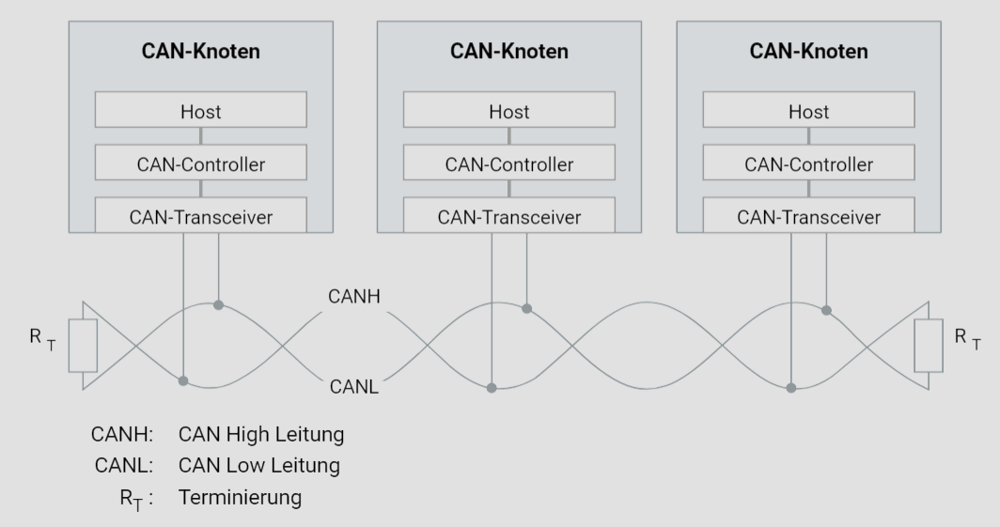
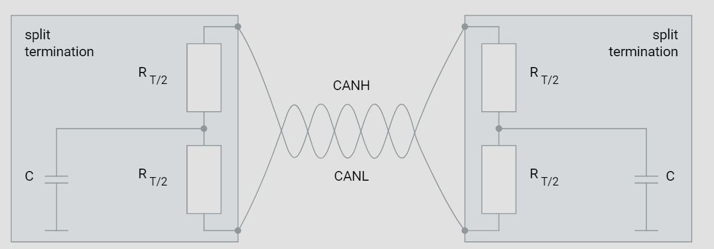

# Terminierung

## Einführung

In modernen Automobilen sind zuverlässige Kommunikationsnetzwerke entscheidend für die Funktionalität und Effizienz von elektronischen Steuergeräten. Neben dem bekannten CAN-Bus (Controller Area Network) hat sich der LIN-Bus (Local Interconnect Network) als kostengünstige Alternative etabliert, insbesondere für Anwendungen, die keine hohen Datenübertragungsraten erfordern. Im Folgenden wird ein detailliertes und wissenschaftlich fundiertes Tutorial zur Bedeutung des Wellenwiderstands und des Abschlusswiderstands im CAN-Bus präsentiert, mit speziellen Hinweisen auf die Relevanz dieser Konzepte für den LIN-Bus.

## Wellenwiderstand

Der Wellenwiderstand (charakteristische Impedanz) eines Übertragungsmediums ist eine fundamentale Eigenschaft, die die Ausbreitung von elektrischen Signalen entlang des Mediums beschreibt. Im Kontext von Hochgeschwindigkeits-Datenübertragungen, wie sie im CAN-Bus üblich sind, spielt der Wellenwiderstand eine entscheidende Rolle.

## Definition und Bedeutung

Der Wellenwiderstand eines Kommunikationskanals, wie beispielsweise eines Twisted-Pair-Kabels im CAN-Bus, beträgt typischerweise 120 Ohm. Dieser Wert ist kein Zufall, sondern ergibt sich aus den physikalischen Eigenschaften des Kabels, einschließlich seiner Induktivität und Kapazität pro Längeneinheit. Ein korrekter Wellenwiderstand ist essentiell, um Reflexionen von Signalen zu vermeiden, die bei Diskontinuitäten im Netzwerk auftreten können.

## Auswirkungen von Reflexionen

Reflexionen entstehen, wenn ein elektrisches Signal auf eine Impedanzdiskontinuität trifft. Dies kann zu Überlagerungen der Signale führen, die die Datenintegrität beeinträchtigen. Im CAN-Bus, der hohe Datenraten überträgt, können solche Reflexionen gravierende Störungen verursachen, die zu Kommunikationsfehlern und einer reduzierten Zuverlässigkeit führen.

## Abschlusswiderstand

Um Reflexionen zu minimieren und die Signalqualität zu gewährleisten, werden die Enden eines CAN-Busses mit Abschlusswiderständen versehen, die dem Wellenwiderstand des Kommunikationskanals entsprechen.

## Standardabschlusswiderstand

Ein typischer Abschlusswiderstand im CAN-Bus hat einen Wert von 120 Ohm und wird an beiden Enden des Buskabels angebracht. Diese Abschlusswiderstände sorgen dafür, dass das Signal vollständig absorbiert wird und keine Reflexionen entstehen, die die Signalübertragung stören könnten.

## Geteilter Abschlusswiderstand

Eine alternative Methode zur Terminierung ist die Verwendung eines geteilten Abschlusswiderstands. Diese Technik verwendet zwei identische Widerstände von jeweils 60 Ohm und eine Kapazität, typischerweise 4,7 nF, die zwischen den beiden Widerständen und der Masse geschaltet wird.

### Funktionsweise und Vorteile

Der geteilte Abschlusswiderstand wirkt als Tiefpassfilter. Hochfrequente Signalanteile werden gegen Masse kurzgeschlossen, während die Gleichspannungsverhältnisse nicht beeinflusst werden. Diese Konfiguration hat mehrere Vorteile:

- **Erhöhung der Störfestigkeit**: Durch die Filterung hochfrequenter Störungen wird die Anfälligkeit des Netzwerks gegenüber elektromagnetischen Störungen reduziert.
- **Reduktion der Emissionen**: Die Filterung der Hochfrequenzkomponenten führt zu einer Verringerung der elektromagnetischen Emissionen, was zu einer besseren Einhaltung gesetzlicher Vorschriften führt.

## Relevanz für den LIN-Bus

Obwohl der LIN-Bus typischerweise niedrigere Datenraten aufweist als der CAN-Bus, gelten die grundlegenden Prinzipien des Wellenwiderstands und des Abschlusswiderstands auch hier. LIN-Bus-Netzwerke müssen ebenfalls sorgfältig entworfen werden, um Reflexionen und Störungen zu minimieren, insbesondere in Anwendungen, die eine hohe Zuverlässigkeit erfordern.

## Unterschiede und Gemeinsamkeiten

- **Datenrate**: LIN-Bus-Netzwerke operieren bei niedrigeren Datenraten, wodurch die Anforderungen an den Wellenwiderstand weniger kritisch sind als im CAN-Bus. Dennoch bleibt eine ordnungsgemäße Terminierung wichtig.
- **Terminierung**: Im LIN-Bus wird typischerweise nur ein Ende des Busses mit einem Abschlusswiderstand versehen, da der Master-Knoten häufig einen eingebauten Abschlusswiderstand hat. Die Verwendung geteilter Abschlusswiderstände ist weniger verbreitet, aber dennoch eine mögliche Methode zur Verbesserung der Signalqualität in speziellen Anwendungen.

## Schlussfolgerung

Die korrekte Terminierung von Kommunikationsbussen wie CAN und LIN ist entscheidend für die Sicherstellung einer zuverlässigen und störungsfreien Datenübertragung. Der Wellenwiderstand muss sorgfältig beachtet und die Enden des Busses entsprechend terminiert werden, um Reflexionen zu minimieren. Die Anwendung geteilter Abschlusswiderstände bietet zusätzliche Vorteile in Bezug auf Störfestigkeit und Emissionsreduktion und kann daher in anspruchsvollen Anwendungen eine sinnvolle Ergänzung darstellen.

Dieses Tutorial hat die theoretischen Grundlagen und praktischen Anwendungen des Wellenwiderstands und der Abschlusswiderstände im Automobilbereich detailliert erläutert. Eine fundierte Kenntnis dieser Konzepte ist für Ingenieure und Techniker im Bereich der Fahrzeugkommunikation unerlässlich, um robuste und zuverlässige Netzwerke zu entwickeln.
