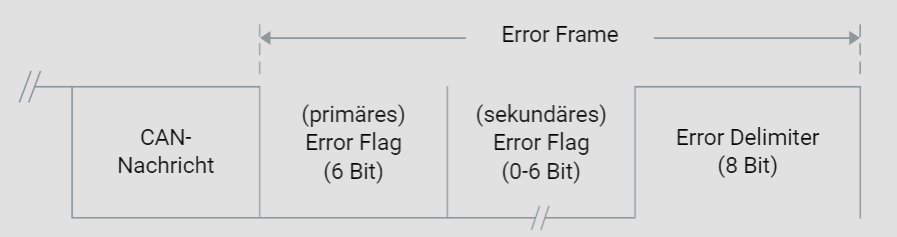
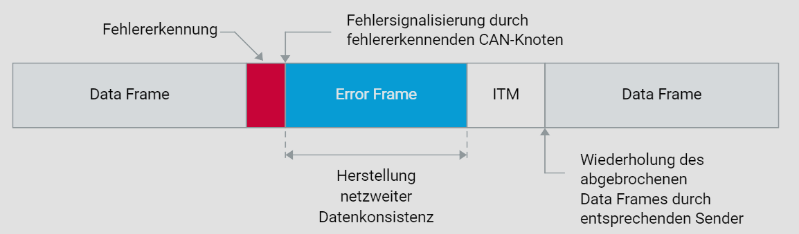

# Fehlerbehandlung

## Netzwerkweite Datenkonsistenz im CAN-Bus

Das Controller Area Network (CAN) Protokoll ist ein robustes Kommunikationsprotokoll, das in Fahrzeugnetzwerken weit verbreitet ist. Ein wesentliches Merkmal des CAN-Protokolls ist seine Fähigkeit, netzwerkweite Datenkonsistenz aufrechtzuerhalten, selbst wenn lokale Störungen auftreten. Dies wird durch die Implementierung spezifischer Fehlererkennungs- und Fehlerbehandlungsmechanismen erreicht.

## Fehlererkennung und Fehlersignalisierung

Wenn ein CAN-Knoten einen Fehler erkennt, ist es seine Pflicht, alle anderen Knoten im Netzwerk darüber zu informieren. Dies geschieht durch die Übertragung eines Fehlersignals, auch Error Flag genannt. Ein Error Flag besteht aus sechs dominanten Bits, die bewusst die Bitstuffingregel verletzen, um einen Bitstuffing-Fehler zu verursachen. Diese bewusste Regelverletzung dient dazu, sicherzustellen, dass alle Knoten im Netzwerk den Fehler erkennen.

## Primäres und Sekundäres Error Flag

Die Übertragung eines Error Flags durch den fehlererkennenden Knoten (primäres Error Flag) löst bei allen anderen Knoten ebenfalls die Übertragung eines Error Flags (sekundäres Error Flag) aus. Dadurch wird die reguläre Datenübertragung abgebrochen und das Netzwerk in einen Fehlerbehandlungsmodus versetzt. In manchen Situationen können sich primäre und sekundäre Error Flags überlagern, was die Gesamtdauer der Fehlerbehandlung beeinflusst.

## Error Delimiter und Bus-Idle-Kennung

Nach der Übertragung eines Error Flags folgt stets ein Error Delimiter. Dieser besteht aus acht rezessiven Bits und ersetzt den ACK-Delimiter und das EOF (End of Frame) einer regulären Botschaftsübertragung. Zusammen mit der obligatorischen Sendepause, der sogenannten Intermission (ITM), ergeben sich auf dem CAN-Bus elf rezessive Bits, die als Bus-Idle-Kennung fungieren.

## Abschluss der Fehlerbehandlung

Die Fehlerbehandlung wird abgeschlossen, indem der Sender der abgebrochenen CAN-Botschaft nach der ITM versucht, die abgebrochene Botschaft erneut zu übertragen. Dies bedeutet jedoch nicht, dass eine sofortige Wiederholung garantiert ist. Der CAN-Bus verwendet ein prioritätengesteuertes Zugriffsverfahren, was bedeutet, dass andere Nachrichten mit höherer Priorität Vorrang haben können.

## Zeitrahmen der Fehlerbehandlung

Die Zeit von der Fehlererkennung bis zum Wiederaufsetzen der abgebrochenen Botschaft variiert:

- **17 Bitzeiten:** Im besten Fall, wenn sich primäres und sekundäres Error Flag überlagern.
- **23 Bitzeiten:** Wenn sich primäres und sekundäres Error Flag nicht überlagern.
- **31 Bitzeiten:** Wenn der fehlerhafte Knoten sich im fehlerpassiven Zustand befindet. In diesem Zustand muss der Knoten eine sogenannte Suspend Transmission Time abwarten, bevor er erneut auf den CAN-Bus zugreifen darf. Diese Sendepause beträgt 8 Bits.

## Fehlerpassiver Zustand und Suspend Transmission Time

Ein Knoten im fehlerpassiven Zustand hat eine verminderte Priorität beim Buszugriff und muss nach einem Fehler eine zusätzliche Pause von 8 Bitzeiten (Suspend Transmission Time) einhalten. Dieser Mechanismus verhindert, dass fehlerhafte Knoten den Bus übermäßig belasten und ermöglicht eine stabilere Netzwerkkonfiguration.

## Zusammenfassung

Das CAN-Protokoll stellt durch seine ausgeklügelten Fehlererkennungs- und Fehlerbehandlungsmechanismen sicher, dass die Datenkonsistenz im Netzwerk aufrechterhalten wird. Die Übertragung von Error Flags, gefolgt von Error Delimiters und einer definierten Sendepause, sorgt dafür, dass alle Knoten synchronisiert bleiben und Fehler effizient behandelt werden können. Die prioritätengesteuerte Natur des CAN-Bus bedeutet jedoch, dass keine sofortige Wiederholung einer abgebrochenen Botschaft garantiert werden kann. Insbesondere im fehlerpassiven Zustand müssen zusätzliche Wartezeiten eingehalten werden, um die Netzwerksicherheit und -stabilität zu gewährleisten.

## Kritische Betrachtung

Einige Aspekte des CAN-Protokolls könnten in spezifischen Anwendungsszenarien Herausforderungen darstellen. Die zusätzliche Latenz durch die Suspend Transmission Time im fehlerpassiven Zustand kann in hochkritischen Echtzeitsystemen problematisch sein. Hier könnten alternative Protokolle oder zusätzliche Fehlerbehandlungsstrategien notwendig sein, um die Systemanforderungen zu erfüllen. Zudem ist die Abhängigkeit von der Priorität beim Buszugriff ein zweischneidiges Schwert, da sie zwar eine effiziente Kommunikation ermöglicht, aber auch zu Verzögerungen bei weniger prioritären Nachrichten führen kann.

Dieses Tutorial bietet eine detaillierte Betrachtung der Fehlerbehandlungsmechanismen im CAN-Bus und zeigt, wie sie zur Aufrechterhaltung der Netzwerkstabilität beitragen. Durch das Verständnis dieser Mechanismen können Entwickler und Ingenieure robustere und zuverlässigere Fahrzeugsysteme entwerfen.
