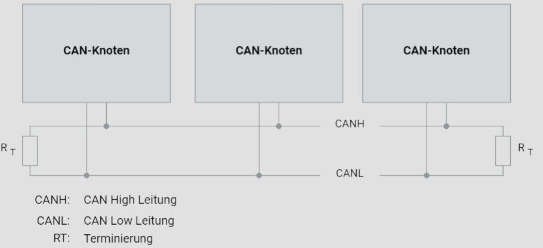

# CAN-Netzwerk

## Aufbau

Ein Controller Area Network (CAN) ist ein robustes Fahrzeugbussystem, das zur Kommunikation zwischen Mikrocontrollern und Geräten ohne Host-Computer konzipiert wurde. Ein typisches CAN-Netzwerk, wie im Bild dargestellt, besteht aus mehreren CAN-Knoten, die über ein physikalisches Übertragungsmedium, den sogenannten CAN-Bus, miteinander verbunden sind. Die Linientopologie ist die gängigste Konfiguration, bei der elektronische Steuergeräte (ECUs) mit CAN-Schnittstelle passiv an einen linearen Bus angeschlossen werden. Alternativ kann auch eine passive Sterntopologie verwendet werden, wobei alle Knoten sternförmig an einen zentralen Punkt angeschlossen sind.

## Physikalisches Übertragungsmedium

Das physikalische Übertragungsmedium in einem CAN-Netzwerk ist in der Regel eine ungeschirmte, verdrillte Zweidrahtleitung (Unshielded Twisted Pair - UTP). Diese verdrillte Paarleitung ermöglicht eine symmetrische Signalübertragung, was Störungen minimiert. Typische Leitungen haben einen Querschnitt zwischen 0,34 mm² und 0,6 mm². Der spezifische Widerstand der Leitung sollte weniger als 60 mΩ/m betragen, um eine effiziente Signalübertragung sicherzustellen.

## Randbedingungen

- **Datenrate und Netzwerkgröße:** Die maximale Datenrate in einem CAN-Netzwerk beträgt 1 MBit/s. Bei dieser Datenrate ist eine maximale Netzwerkreichweite von etwa 40 Metern zulässig.
- **Busabschlusswiderstände:** An den Enden des CAN-Busses befinden sich Abschlusswiderstände (RT), um Reflexionen zu vermeiden und die Signalintegrität zu gewährleisten. Diese Widerstände haben typischerweise einen Wert von 120 Ohm.
- **Anzahl der Knoten:** Gemäß der ISO 11898-Norm darf ein CAN-Netzwerk bis zu 32 Knoten umfassen.

## CAN-Netzwerk mit drei Knoten

Das untere Bild zeigt ein typisches CAN-Netzwerk mit drei CAN-Knoten (Steuergeräten), die an einen CAN-Bus angeschlossen sind. Die beiden Leitungen, CANH (CAN High Leitung) und CANL (CAN Low Leitung), sind die beiden verdrillten Drähte, die das symmetrische Signal übertragen. An beiden Enden des Busses sind Abschlusswiderstände (RT) installiert, um Reflexionen zu verhindern und die Signalqualität zu sichern. Eine mögliche Ergänzung könnte die Erwähnung der spezifischen Anforderungen an die Länge und Verdrillung der Leitungen sein, um elektromagnetische Störungen weiter zu minimieren. Auch die Integration von Busüberwachung und Diagnosefunktionen könnte für ein umfassendes Verständnis von CAN-Netzwerken sinnvoll sein.

## Schlussfolgerung

Ein CAN-Netzwerk ist eine wesentliche Komponente in der Fahrzeugtechnik, die eine zuverlässige und effiziente Kommunikation zwischen verschiedenen elektronischen Steuergeräten ermöglicht. Durch die Einhaltung der beschriebenen technischen Spezifikationen und Normen kann die Leistungsfähigkeit und Zuverlässigkeit eines CAN-Systems sichergestellt werden.
