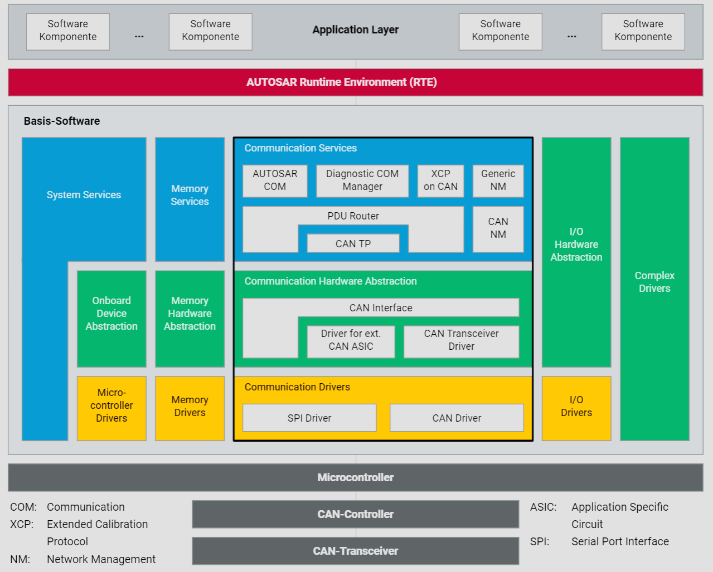

# CAN-Knoten

## Einleitung

Die fortschreitende Elektronifizierung des Automobils führt zu einer rasanten Zunahme der Quantität und Komplexität der Software. Moderne Fahrzeuge, insbesondere in der Oberklasse, verfügen über mehr als 1000 Software-Funktionen, die auf über 70 elektronischen Steuergeräten (Electronic Control Units – ECUs) in verschiedenen Bussystemen ausgeführt werden. Ein elektronisches Steuergerät in einem CAN-Netzwerk wird als CAN-Knoten bezeichnet.

## Steigende Komplexität in der Steuergerätevernetzung

In den Anfängen der Steuergerätevernetzung war ein einfacher CAN-Treiber ausreichend, der eine weitgehend hardwareunabhängige Schnittstelle für die Applikation bereitstellte. Ein CAN-Controller und ein CAN-Transceiver ermöglichten die Realisierung der CAN-Schnittstelle. Heutzutage sind ein Betriebssystem und Funktionen des Netzwerkmanagements sowie der Diagnose unabdingbar. Die stark gewachsene Softwarekomplexität erfordert eine Vereinheitlichung der Steuergeräteinfrastruktur.

## Vereinheitlichung der Software

Eine einheitliche Softwarearchitektur reduziert den Entwicklungsaufwand und erleichtert die Wartung. Sie ermöglicht zudem eine höhere Wiederverwendbarkeit und Austauschbarkeit von Software-Komponenten zwischen verschiedenen Fahrzeugplattformen und zwischen OEMs (Original Equipment Manufacturer) und Zulieferern.

## AUTOSAR (AUTomotive Open System ARchitecture)

AUTOSAR bietet eine Referenzarchitektur für Steuergerätesoftware, mit dem Ziel, die Softwareentwicklung zu standardisieren und zu vereinfachen. Im Mittelpunkt dieser Architektur steht das AUTOSAR Runtime Environment (RTE), welches das Netzwerk vollständig von den Applikationssoftware-Komponenten entkoppelt. Das RTE bietet den Software-Komponenten einheitliche Dienste in Form der Basis-Software. Diese Basis-Software ist in drei Ebenen unterteilt: Microcontroller Abstraction Layer, ECU Abstraction Layer und Service Layer.

## Aufbau eines CAN-Knotens

Die folgende Grafik zeigt den Aufbau eines modernen CAN-Knotens gemäß der AUTOSAR-Architektur.

### Microcontroller Abstraction Layer

Diese unterste Ebene abstrahiert die Hardware und stellt Treiber bereit, die direkt mit der Hardware interagieren. Dazu gehören:

- **Microcontroller Drivers**: Treiber für die grundlegende Funktionalität des Mikrocontrollers.
- **Memory Drivers**: Treiber für den Zugriff auf den Speicher.
- **I/O Drivers**: Treiber für Eingabe-/Ausgabegeräte.

### ECU Abstraction Layer

Diese Ebene abstrahiert die spezifische Hardware der ECUs und ermöglicht eine hardwareunabhängige Softwareentwicklung. Zu den Komponenten gehören:

- **Communication Drivers**: Treiber für die Kommunikation, z.B. CAN- und SPI-Treiber.
- **Communication Hardware Abstraction**: Abstraktionsschicht für die Kommunikationshardware, wie CAN-Interfaces und Transceiver-Treiber.
- **Memory Hardware Abstraction**: Abstraktionsschicht für den Speicherzugriff.
- **Onboard Device Abstraction**: Abstraktionsschicht für die Steuergeräte-Hardware.

### Service Layer

Diese höchste Ebene der Basis-Software bietet verschiedene Dienste für die Applikationssoftware. Zu den wichtigsten Komponenten gehören:

- **System Services**: Basisdienste für die Systemverwaltung.
- **Memory Services**: Dienste für den Speicherzugriff und -verwaltung.
- **Communication Services**: Diese umfassen AUTOSAR COM für die Standardkommunikation, den Diagnostic COM Manager für Diagnosedienste und Generic NM/CAN NM für das Netzwerkmanagement. Der PDU Router koordiniert die Kommunikation zwischen diesen Diensten und dem CAN TP (Transportprotokoll).

## Schlussfolgerung

Die Verwendung der AUTOSAR-Architektur in modernen Fahrzeugen ermöglicht eine strukturierte und effiziente Entwicklung von Steuergerätesoftware. Durch die Entkopplung der Applikationssoftware von der Hardware und die Bereitstellung einheitlicher Dienste wird die Komplexität beherrschbar und die Wiederverwendbarkeit von Software-Komponenten gefördert. Dies trägt wesentlich zur Reduzierung von Entwicklungskosten und zur Erhöhung der Qualität und Zuverlässigkeit der Fahrzeugsoftware bei.
