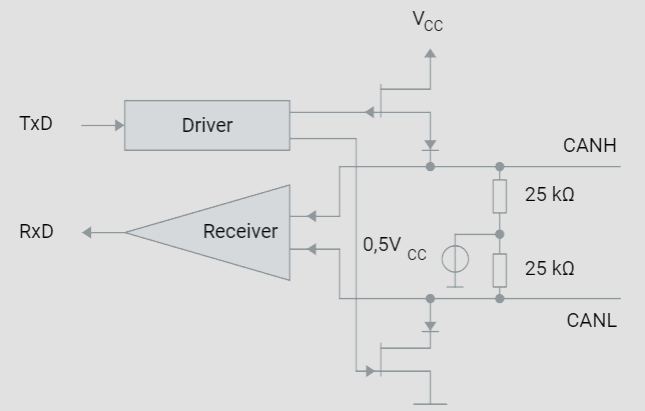

# CAN-Transceiver

## Busankopplung in CAN-Netzwerken

In modernen Fahrzeugen wird die Ankopplung des CAN-Controllers an das Kommunikationsmedium (CAN-Bus) in der Regel durch CAN-Transceiver realisiert. Dies ist eine Weiterentwicklung gegenüber der früheren diskreten Realisierung. Die symmetrische physikalische Signalübertragung in einem CAN-Netzwerk gewährleistet eine hohe elektromagnetische Verträglichkeit. Das physikalische Übertragungsmedium besteht aus zwei Leitungen: der CAN-High-Leitung (CANH) und der CAN-Low-Leitung (CANL). Entsprechend verfügen CAN-Transceiver über zwei Buspins für diese Leitungen.

1. **CAN-Transceiver**:

   - **TxD (Transmit Data)**: Eingangssignal vom Mikrocontroller.
   - **Driver**: Sendet das Signal auf den CAN-Bus.
   - **CANH und CANL**: Busleitungen für differenzielle Signalübertragung.
   - **RxD (Receive Data)**: Ausgangssignal zum Mikrocontroller.
   - Der Transceiver sorgt dafür, dass die Differenzspannung zwischen CANH und CANL entsprechend der Spezifikation gehalten wird.
2. **Busankopplung mit CMC**:

   - **Common Mode Choke (CMC)**: Reduziert Emissionen und erhöht die Störfestigkeit.
   - Die CMC wird zwischen den CAN-Bus-Leitungen und den CANH- und CANL-Pins des Transceivers geschaltet, um symmetrische Störungen zu unterdrücken.

## High-Speed und Low-Speed CAN-Transceiver

Es gibt zwei Haupttypen von CAN-Transceivern: High-Speed und Low-Speed. High-Speed-CAN-Transceiver unterstützen Datenraten bis zu 1 MBit/s, während Low-Speed-CAN-Transceiver Datenraten bis zu 125 KBit/s unterstützen. Low-Speed-Transceiver bieten jedoch den Vorteil einer fehlertoleranten Busankopplung, sodass der Ausfall einer der beiden Kommunikationsleitungen nicht zum Ausfall des gesamten Kommunikationsbetriebs führt.

## Aufbau eines CAN-Transceivers

Die Struktur eines High-Speed-CAN-Transceivers ist in der beigefügten Grafik dargestellt. Wenn beide Ausgangstransistoren gesperrt sind, nehmen beide CAN-Leitungen das gleiche Potenzial (0,5*Vcc) an, wodurch die Differenzspannung null ist. Sobald beide Transistoren durchschalten, entsteht zwischen den Leitungen eine vom Lastwiderstand abhängige Spannungsdifferenz, die gemäß ISO 11898-2 2 Volt betragen sollte. Dabei fließt ein Strom von etwa 35 mA.

## Störfestigkeit

CAN-Transceiver zeichnen sich durch eine geringe Emission und eine hohe Störfestigkeit aus, die durch einen breiten Gleichtaktarbeitsbereich erreicht wird. Moderne Transceiver bieten zudem einen ESD-Schutz von bis zu 8 kV. In besonders kritischen Anwendungen kann eine nahe am Ausgang geschaltete Gleichtaktdrossel (Common Mode Choke - CMC) verwendet werden, um Emissionen weiter zu reduzieren.

## Maximale Anzahl an CAN-Knoten

Die ISO 11898 gibt eine maximale Anzahl von 32 CAN-Knoten vor. In der Praxis hängt die maximale Anzahl der Knoten jedoch stark von der Leistungsfähigkeit der verwendeten CAN-Transceiver ab und davon, ob es sich um ein High-Speed- oder Low-Speed-Netzwerk handelt. Beispielsweise können mit dem High-Speed-CAN-Transceiver TJA1050 in einem entsprechenden Netzwerk bis zu 110 Knoten verbunden werden.
