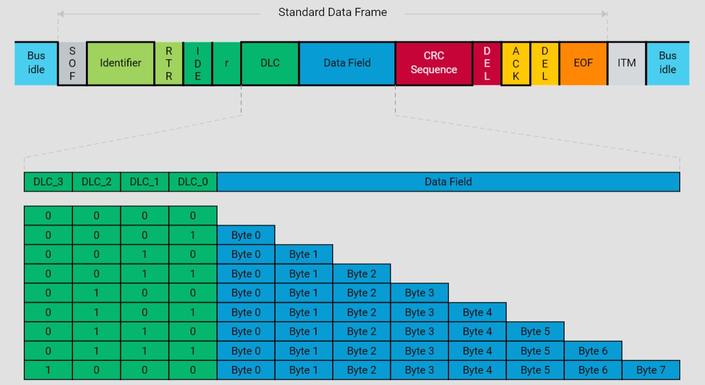
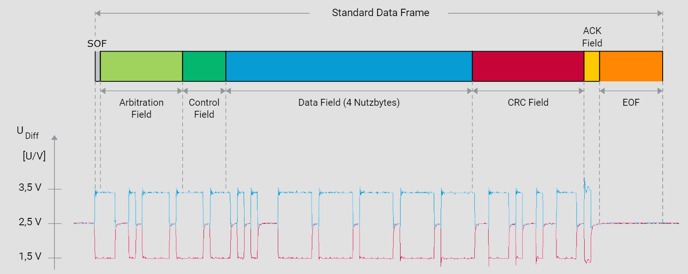

# Struktur und Funktion von Data Frames im CAN-Netzwerk

## Einleitung

Der Controller Area Network (CAN)-Bus ist ein wesentlicher Bestandteil moderner Automobile, der eine zuverlässige Kommunikation zwischen verschiedenen elektronischen Steuergeräten (ECUs) ermöglicht. In diesem Kontext nehmen Data Frames eine zentrale Rolle ein, da sie die Nutzdaten übertragen. Dieser Leitfaden beschreibt detailliert den Aufbau und die Funktion jedes Elements eines CAN Data Frames, um ein tiefgehendes Verständnis für dessen Mechanismen und Anwendungen zu vermitteln.

## Aufbau eines CAN Data Frames

Ein CAN Data Frame setzt sich aus mehreren Komponenten zusammen, die jeweils spezifische Aufgaben während der Übertragung erfüllen. Diese Komponenten gewährleisten die Initiierung und Aufrechterhaltung der Synchronisation zwischen Kommunikationspartnern, die Herstellung der definierten Kommunikationsbeziehungen sowie die Übertragung und Sicherung der Nutzdaten. Im Folgenden werden die einzelnen Komponenten eines CAN Data Frames erläutert:

### 1. Start of Frame (SOF)

Die Übertragung eines Data Frames beginnt mit dem Startbit, auch als Start Of Frame (SOF) bezeichnet. Dieses Bit wird vom Sender dominant übertragen und sorgt durch den Wechsel des Signalpegels von rezessiv (Bus Idle) nach dominant für die netzwerkweite Synchronisation. Empfänger vergleichen während der Übertragung alle Signalflankenwechsel von rezessiv nach dominant mit ihrem eingestellten Bittiming. Bei Abweichungen synchronisieren sich die Empfänger, um den Phasenfehler auszugleichen (Nachsynchronisation).

### 2. Identifier (ID) und Remote Transmission Request (RTR)

Dem SOF folgt der Identifier (ID), der die Priorität des Data Frames festlegt und in Verbindung mit der Akzeptanzfilterung die in der Kommunikationsmatrix definierten Sender-Empfänger-Relationen im CAN-Netzwerk sicherstellt. Das RTR-Bit (Remote Transmission Request) informiert die Empfänger über den Frametyp: Ein dominantes RTR-Bit zeigt einen Data Frame an, während ein rezessives RTR-Bit einen Remote Frame anzeigt.

### 3. Identifier Extension (IDE)

Das Identifier Extension (IDE)-Bit unterscheidet zwischen dem Standard- und Extended-Format. Im Standard-Format umfasst der Identifier 11 Bit, während er im Extended-Format 29 Bit umfasst. Diese Unterscheidung ermöglicht die Anpassung der Identifier-Länge an spezifische Anforderungen des Netzwerks.

### 4. Data Length Code (DLC)

Der Data Length Code (DLC) gibt die Anzahl der zu übertragenden Nutzbytes an. Diese Nutzbytes werden im Data Field transportiert. Ein Data Frame kann maximal acht Nutzbytes übertragen.

### 5. Data Field

Das Data Field enthält die eigentlichen Nutzdaten, die im Rahmen der CAN-Kommunikation übertragen werden. Die Länge des Data Fields variiert je nach im DLC angegebenen Anzahl der Bytes.

### 6. Cyclic Redundancy Check (CRC) und Acknowledgement (ACK)

Zur Sicherung der übertragenen Nutzbytes wird eine Prüfsumme unter Anwendung des Cyclic Redundancy Checks (CRC) erstellt. Basierend auf dem Ergebnis des CRCs quittieren die Empfänger im ACK-Slot (Acknowledgement) den Empfang des Frames entweder positiv oder negativ.

### 7. End of Frame (EOF)

Die Übertragung eines Data Frames wird mit sieben rezessiven Bits, dem End Of Frame (EOF), beendet. Diese Bits signalisieren das Ende der Übertragung und ermöglichen den Übergang in den Bus Idle-Zustand.

## Fazit

Ein tiefgehendes Verständnis der Struktur und Funktionsweise von CAN Data Frames ist für die Entwicklung und Wartung von CAN-Netzwerken essenziell. Jedes Element eines Data Frames spielt eine spezifische Rolle bei der Sicherstellung einer zuverlässigen und effizienten Kommunikation. Durch die Kenntnis dieser Elemente können Entwickler und Ingenieure robustere und effizientere CAN-basierte Systeme gestalten und implementieren.

 