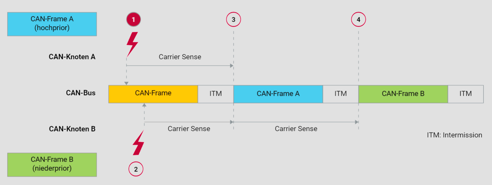
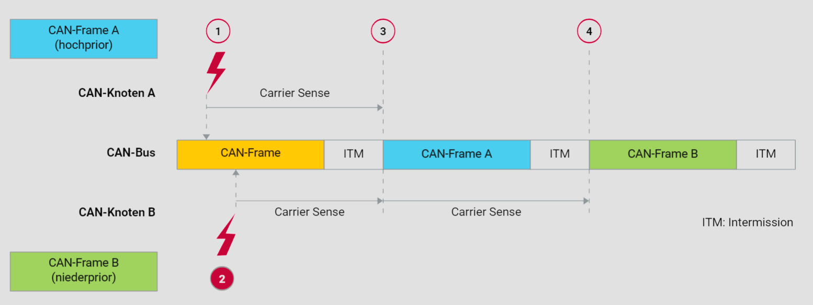
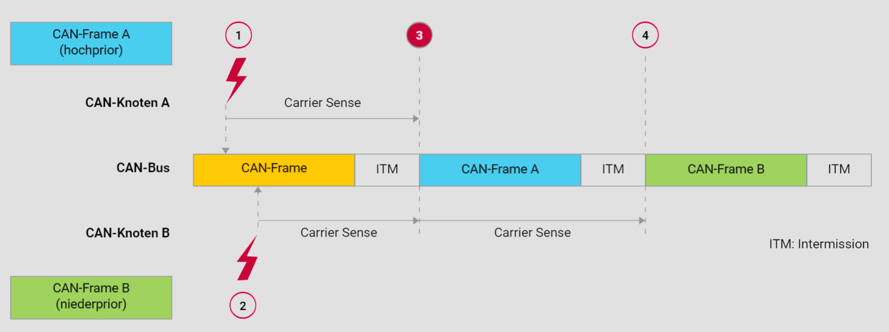
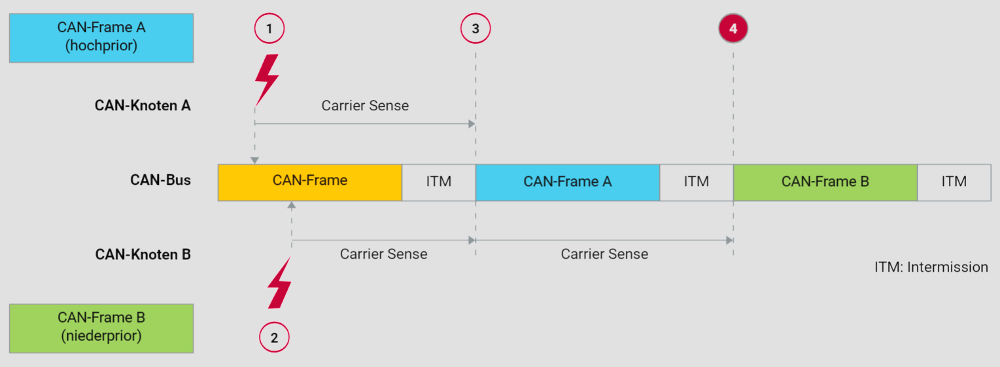

# Buszugriffs im CAN-Netzwerk

## Einleitung

Der CAN-Bus (Controller Area Network) ist ein robustes Fahrzeugnetzwerk, das es Mikrocontrollern und Geräten ermöglicht, miteinander zu kommunizieren, ohne einen Host-Computer. Der Standard ISO 11898-1 definiert die Spezifikationen für die Kommunikation im CAN-Bus. In diesem Abschnitt werden die Mechanismen des Buszugriffs im CAN-Netzwerk detailliert beschrieben und erklärt, wie Kollisionen vermieden werden.

## Grundlagen des CAN-Buszugriffs

Im CAN-Netzwerk haben alle Knoten gleichberechtigten Zugang zum Bus, was bedeutet, dass jeder Knoten jederzeit das Recht hat, eine Nachricht zu senden. Diese Architektur wird als Multi-Master-Architektur bezeichnet. Sie gewährleistet eine hohe Verfügbarkeit und erlaubt eine ereignisgesteuerte Datenübertragung. Jedoch birgt sie auch die Gefahr von Kollisionen, wenn mehrere Knoten gleichzeitig den Bus verwenden möchten.

## Kollisionsvermeidung

Um Kollisionen zu vermeiden und die Echtzeitfähigkeit des Systems zu gewährleisten, verwendet der CAN-Bus das CSMA/CA-Verfahren (Carrier Sense Multiple Access with Collision Avoidance). Dieses Verfahren stellt sicher, dass Knoten nur dann auf den Bus zugreifen, wenn dieser frei ist.

1. **Carrier Sense**: Jeder Knoten überwacht kontinuierlich den Zustand des Busses. Bevor ein Knoten eine Nachricht sendet, prüft er, ob der Bus frei ist.
2. **Multiple Access**: Mehrere Knoten können auf den Bus zugreifen, jedoch nicht gleichzeitig.
3. **Collision Avoidance**: Wenn der Bus belegt ist, warten die Knoten, bis der Bus frei wird, bevor sie ihre Nachrichten senden. Dadurch werden Kollisionen vermieden.

## Bitweise Busarbitrierung

Das Verfahren der bitweisen Busarbitrierung ist ein zentraler Bestandteil des CSMA/CA und sorgt dafür, dass immer die Nachricht mit der höchsten Priorität gesendet wird.

1. **Priorität der Nachrichten**: Jede Nachricht im CAN-Bus hat eine eindeutige Priorität, die durch ihre Identifier (ID) bestimmt wird. Nachrichten mit niedrigeren ID-Werten haben höhere Prioritäten.
2. **Arbitrierungsprozess**: Wenn mehrere Knoten gleichzeitig den Bus nutzen wollen, wird die Nachricht mit der höchsten Priorität (niedrigste ID) bevorzugt. Die anderen Knoten ziehen sich zurück und versuchen es erneut, sobald der Bus frei ist.

## Ereignis 1

## Ereignis 2

## Ereignis 3

## Ereignis 4

## Technische Erläuterungen

- **Carrier Sense**: Dieser Mechanismus überwacht kontinuierlich den Zustand des Busses. Er stellt sicher, dass ein Knoten nur dann sendet, wenn der Bus tatsächlich frei ist. Dies ist ein wichtiger Aspekt des CSMA/CA-Verfahrens.
- **Intermission (ITM)**: Die ITM-Periode ist eine kurze Pause zwischen den Nachrichten, die notwendig ist, um den Busstatus zu stabilisieren und eine klare Trennung zwischen den Nachrichten zu gewährleisten. Sie verhindert auch Kollisionen bei aufeinanderfolgenden Nachrichten.
- **Buszugriffsprotokoll**: Das Protokoll für den Buszugriff stellt sicher, dass der CAN-Bus effizient genutzt wird und dass Nachrichten in der Reihenfolge ihrer Priorität gesendet werden. Dies ist entscheidend für die Echtzeitfähigkeit des Systems.

# Beispiel für Busarbitrierung

Ein praktisches Beispiel für die bitweise Busarbitrierung:

- Knoten A hat eine Nachricht mit der ID 0x100 (höhere Priorität).
- Knoten B hat eine Nachricht mit der ID 0x200 (niedrigere Priorität).

Wenn beide Knoten gleichzeitig senden möchten:

- Beide Knoten senden die Bits ihrer IDs gleichzeitig auf den Bus.
- Der Buszustand wird von allen Knoten überwacht.
- Sobald Knoten B ein Bit sendet, das mit einem höheren Bit von Knoten A kollidiert, erkennt Knoten B die höhere Priorität und zieht sich zurück.
- Knoten A setzt die Übertragung fort, da seine Nachricht die höhere Priorität hat.

# Fazit

Die Mechanismen des Buszugriffs im CAN-Netzwerk, wie in der ISO 11898-1 beschrieben, sind darauf ausgelegt, eine effiziente und kollisionsfreie Kommunikation zu gewährleisten. Durch die Verwendung von CSMA/CA und der bitweisen Busarbitrierung können Nachrichten in Echtzeit übertragen werden, was besonders für sicherheitskritische Anwendungen in Fahrzeugen und industriellen Steuerungssystemen von großer Bedeutung ist. Die detaillierte Analyse und die grafische Darstellung helfen, diese komplexen Prozesse besser zu verstehen und ihre Bedeutung für die Zuverlässigkeit und Effizienz des CAN-Busses zu erkennen.
