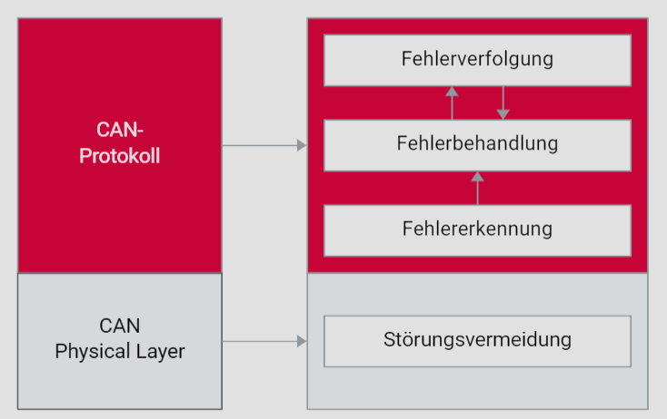

# Datenintegrität im Kfz

## Einführung

Die Sicherstellung einer zuverlässigen Datenübertragung ist entscheidend für die Sicherheit und Funktionalität elektronischer Systeme in modernen Kraftfahrzeugen. Der Controller Area Network (CAN)-Bus ist ein weit verbreitetes Kommunikationssystem, das in Kfz-Anwendungen eingesetzt wird, um verschiedene elektronische Steuergeräte (ECUs) zu verbinden und den Datenaustausch zu ermöglichen. Die Anforderungen an den CAN-Bus umfassen nicht nur strikte Echtzeitanforderungen, sondern auch die Gewährleistung einer hohen Datenintegrität, insbesondere in zeit- und sicherheitskritischen Anwendungen.

## Elektromagnetische Verträglichkeit (EMV)

Die elektromagnetische Verträglichkeit (EMV) ist ein zentraler Aspekt bei der Sicherstellung der Datenintegrität in Kfz-Netzwerken. EMV bezieht sich auf die Fähigkeit eines elektronischen Systems, in einer elektromagnetischen Umgebung zu funktionieren, ohne durch diese gestört zu werden oder selbst Störungen zu verursachen. Die physikalische Systemauslegung spielt hierbei eine entscheidende Rolle. Durch geeignete Maßnahmen wie die Verwendung von abgeschirmten Kabeln und der Einhaltung von EMV-Richtlinien kann die Störanfälligkeit des CAN-Busses verringert werden.

## Mögliche Fehlerquellen

Trotz sorgfältiger EMV-Planung und physikalischer Datensicherungsmaßnahmen können verschiedene Störquellen die Datenintegrität beeinträchtigen. Zu den häufigsten Fehlerquellen gehören:

- **Galvanische Kopplungen**: Elektrische Verbindungen, die unerwünschte Ströme zwischen verschiedenen Teilen des Netzwerks verursachen.
- **Induktive Kopplungen**: Magnetische Felder, die durch fließende Ströme in Leitern erzeugt werden und Störungen in benachbarten Leitungen induzieren.
- **Kapazitive Kopplungen**: Elektrische Felder, die durch Spannungsunterschiede zwischen Leitern entstehen und Störungen verursachen können.
- **Signaldämpfung**: Abschwächung des Signals über lange Übertragungsstrecken.
- **Signalverzerrungen**: Veränderungen des Signalverlaufs durch verschiedene physikalische Effekte.
- **Unterschiedliche Abtastzeitpunkte**: Variationen in den Zeitpunkten, zu denen Kommunikationspartner das Signal abtasten.
- **Unterschiedliche Schaltschwellen**: Variationen in den Schwellenwerten, bei denen Schaltvorgänge ausgelöst werden.
- **Frequenzabweichungen**: Unterschiede in den Taktraten der Kommunikationspartner.

Diese Faktoren können zu einer fehlerhaften Datenübertragung führen, weshalb eine störungsfreie Datenübertragung nicht immer gewährleistet werden kann.

## Minimierung der Restfehlerwahrscheinlichkeit

Die Datenintegrität lässt sich als Produkt der Wahrscheinlichkeit, dass Daten während der Übertragung gestört und verfälscht werden, und der Wahrscheinlichkeit, dass gestörte Daten unerkannt bleiben, verstehen. Daraus ergeben sich zwei Hauptstrategien zur Minimierung der Restfehlerwahrscheinlichkeit und zur Erhöhung der Datenintegrität:

1. **Vermeidung von verfälschten Daten**: Dies kann durch eine elektromagnetisch verträgliche Netzwerkauslegung und physikalische Maßnahmen wie die Verwendung von Twisted-Pair-Kabeln erreicht werden. Twisted-Pair-Kabel sind besonders effektiv, da sie Störungen durch induktive und kapazitive Kopplungen verringern können.
2. **Erkennung und Korrektur von verfälschten Daten**: Dies erfolgt durch leistungsfähige logische Fehlererkennung und effektive logische Fehlerbehandlung. Fehlererkennungsmechanismen wie Cyclic Redundancy Check (CRC) und Fehlerkorrekturmechanismen wie Hamming-Codes können verwendet werden, um Fehler zu identifizieren und zu korrigieren.

## Prinzip der Datensicherung im CAN-Netzwerk

Das Prinzip der Datensicherung im CAN-Netzwerk basiert auf einer Kombination aus physikalischen und logischen Maßnahmen zur Gewährleistung der Datenintegrität. 

- **Physikalische Maßnahmen**: Diese umfassen die Wahl geeigneter Kabel, Steckverbinder und die korrekte Verlegung der Leitungen im Fahrzeug. Besonderes Augenmerk liegt auf der Vermeidung von Störquellen und der Minimierung von Störungen durch geeignete Abschirmungen und Erdungen.
- **Logische Maßnahmen**: Hierzu gehören Protokolle und Algorithmen zur Fehlererkennung und -korrektur, die innerhalb der CAN-Controller implementiert sind. Diese Mechanismen überwachen kontinuierlich den Datenverkehr und greifen bei Erkennung von Fehlern ein, um die Integrität der Daten zu gewährleisten.

## Fazit

Die Sicherstellung der Datenintegrität im Kfz-Bereich ist eine komplexe Aufgabe, die sowohl physikalische als auch logische Maßnahmen erfordert. Der CAN-Bus muss nicht nur den hohen Echtzeitanforderungen gerecht werden, sondern auch eine sichere und zuverlässige Datenübertragung gewährleisten. Durch eine sorgfältige Systemauslegung, Einhaltung von EMV-Richtlinien und den Einsatz fortschrittlicher Fehlererkennungs- und -korrekturmechanismen kann die Restfehlerwahrscheinlichkeit minimiert und die Datenintegrität maximiert werden.