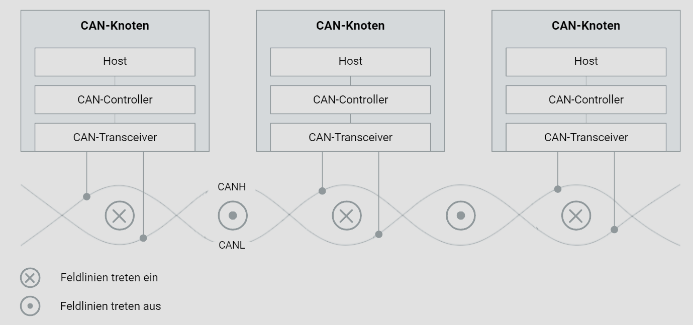

# Symmetrische Signalübertragung

## Einführung in die symmetrische Signalübertragung

Symmetrische Signalübertragung ist eine Methode, die häufig im Automobilbereich verwendet wird, um die Übertragung von Daten robust gegenüber elektromagnetischen Störungen zu machen. Diese Methode ist besonders wichtig in Systemen wie dem Controller Area Network (CAN), das als Rückgrat für die Kommunikation zwischen verschiedenen Steuergeräten in modernen Fahrzeugen dient.

## Prinzip der symmetrischen Signalübertragung

Bei der symmetrischen Signalübertragung werden die Daten auf zwei Leitungen übertragen: der CAN-High-Leitung (CANH) und der CAN-Low-Leitung (CANL). Diese beiden Leitungen sind so konzipiert, dass sie gleiche und entgegengesetzte Signale tragen. Störungen, die von externen Quellen wie Motoren, Zündanlagen oder Schaltkontakten induziert werden, wirken sich auf beide Leitungen gleichermaßen aus.

## Differenzbildung zur Störunterdrückung

Das zentrale Prinzip der symmetrischen Signalübertragung ist die Differenzbildung. Da die Störungen auf beiden Leitungen in gleicher Weise auftreten, heben sie sich durch die Differenzbildung auf. Das Nutzsignal bleibt dabei ungestört. Dies führt zu einer hohen Störfestigkeit und sorgt dafür, dass das CAN-Bus-System zuverlässig arbeiten kann.

## Physikalisches Übertragungsmedium

Der CAN-Bus nutzt zwei Leitungen, die als symmetrisches Paar arbeiten. Diese Leitungen sind die CANH und die CANL. Durch diese Konfiguration wird sichergestellt, dass jede externe Störung, die auf eine Leitung wirkt, auch die andere Leitung beeinflusst, aber in umgekehrter Polarität. Die Differenzbildung zwischen diesen beiden Signalen eliminiert somit die Störungen.

## Umgang mit magnetischen Feldern

Eine weitere wesentliche Eigenschaft der symmetrischen Signalübertragung ist die Handhabung magnetischer Felder. In einem symmetrischen System erzeugen die elektrischen Felder der beiden Leitungen entgegengesetzte magnetische Felder. Wenn die Leitungen eng aneinander liegen, heben sich diese magnetischen Felder weitgehend auf. Dies reduziert die elektromagnetische Abstrahlung, was besonders wichtig ist, um Interferenzen mit anderen elektronischen Systemen im Fahrzeug zu vermeiden.

## Verdrillte Leitungspaare (Twisted Pairs)

Um die beschriebenen Vorteile zu maximieren, werden die beiden Leitungen des CAN-Bus verdrillt. Diese Technik wird als Verwendung von "Twisted Pairs" bezeichnet. Durch das Verdrillen der Leitungen wird die Induktionswirkung weiter reduziert. Die Verdrillung sorgt dafür, dass die induzierten Spannungen in den einzelnen Schleifenabschnitten sich gegenseitig aufheben.

## Effektivität der Verdrillung

Die Wirksamkeit der Verdrillung hängt von der Anzahl der Umschlingungen ab. Mehr Umschlingungen pro Längeneinheit führen zu einer besseren Unterdrückung der induzierten Störungen. Im Allgemeinen wird eine Verdrillungsrate von mindestens 30 Umschlingungen pro Meter empfohlen, um eine ausreichende Reduktion der magnetischen Einflüsse zu gewährleisten.

## Zusammenfassung

Die symmetrische Signalübertragung ist ein entscheidendes Konzept im Automotivebereich, das durch die Differenzbildung und die Verwendung von verdrillten Leitungspaaren eine hohe Störsicherheit gewährleistet. Diese Techniken minimieren die elektromagnetische Abstrahlung und verbessern die Zuverlässigkeit und Leistungsfähigkeit des CAN-Bus-Systems.

## Weiterführende Themen

Für ein tieferes Verständnis könnten folgende Themen weiter untersucht werden:

- Spezifische Implementierungen von CAN-Bus-Systemen in verschiedenen Fahrzeugmodellen.
- Vergleich der symmetrischen Signalübertragung mit anderen Signalübertragungstechniken.
- Auswirkungen unterschiedlicher Verdrillungsraten auf die Signalqualität in verschiedenen Betriebsumgebungen.

 
