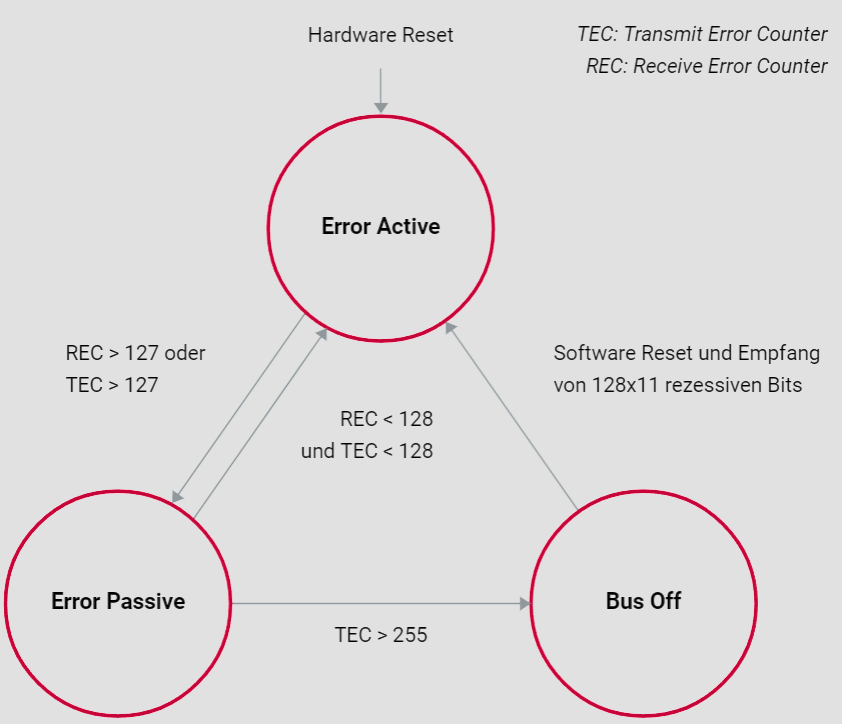

# Fehlerbehandlung

## Einleitung

Das Controller Area Network (CAN) ist ein robustes Fahrzeugbussystem, das hauptsächlich in der Automobilindustrie verwendet wird, um Mikrocontroller und Geräte ohne Host-Computer miteinander zu verbinden. Um die Netzwerkkonsistenz und -stabilität zu gewährleisten, ist es wichtig, Mechanismen zu haben, die Fehler erkennen und behandeln. Dieses Tutorial erklärt die Fehlerbehandlungsmechanismen des CAN-Protokolls im Detail und zeigt auf, wie Fehlerzähler (Transmit Error Counter, TEC, und Receive Error Counter, REC) dazu beitragen, Busblockaden zu vermeiden.

## Fehlererkennung und Fehlerverfolgung im CAN-Netzwerk

### Busblockade vermeiden

Im CAN-Netzwerk hat jeder Knoten die Möglichkeit, eine als fehlerhaft interpretierte CAN-Nachricht abzubrechen. Dies gilt auch für Fälle, in denen ein Knoten irrtümlich eine korrekte Nachricht als fehlerhaft erkennt. Um zu verhindern, dass solche Fehlinterpretationen zu einer Blockierung des Übertragungsmediums führen, verwendet das CAN-Protokoll eine Fehlerverfolgung. Diese Fehlerverfolgung unterscheidet zwischen gelegentlich auftretenden und anhaltenden Störungen.

### Fehlerzähler: TEC und REC

Jeder CAN-Controller führt zwei Arten von Fehlerzählern:

1. **Transmit Error Counter (TEC):** Dieser Zähler wird bei der Übertragung von Nachrichten verwendet.
2. **Receive Error Counter (REC):** Dieser Zähler wird beim Empfang von Nachrichten verwendet.

Die Zähler werden nach spezifischen Regeln angepasst:

- Erfolgreiche Übertragung einer Daten- oder Fernanforderungsnachricht: TEC = TEC - 1; REC = REC - 1
- Erkennung und Übertragung eines Fehler-Flags:
  - Sender: TEC = TEC + 8
  - Fehlererkennender Empfänger: REC = REC + 1
  - Fehlerverursachender Empfänger: REC = REC + 8

### Fehlerzustände im CAN-Controller

#### Error Active

Ein CAN-Controller startet im Zustand **Error Active**. In diesem Zustand kann der Controller nach der Detektion eines Fehlers ein aktives Fehler-Flag senden, das aus sechs dominanten Bits besteht. Dies signalisiert anderen Knoten im Netzwerk, dass ein Fehler aufgetreten ist.

#### Error Passive

Wenn der Fehlerzähler einen bestimmten Schwellenwert überschreitet (TEC > 127 oder REC > 127), wechselt der CAN-Controller in den Zustand **Error Passive**. In diesem Zustand kann der Controller nur noch ein passives Fehler-Flag senden, das aus sechs rezessiven Bits besteht. Dadurch wird die Fähigkeit des Controllers eingeschränkt, Fehler global im Netzwerk zu signalisieren. Zusätzlich muss ein Controller im Zustand Error Passive beim Senden von zwei aufeinanderfolgenden Daten- oder Fernanforderungsnachrichten eine zusätzliche "Suspend Transmission Time" von 8 Bits einhalten.

#### Bus Off

Bei extremer Fehlerhäufung oder einem Ausfall wechselt der CAN-Controller in den Zustand **Bus Off**. In diesem Zustand trennt sich der Controller vom CAN-Bus, um zu verhindern, dass der fehlerhafte Knoten das Netzwerk weiter stört. Der Zustand Bus Off kann nur durch einen Eingriff des Hosts (mit einer erzwungenen Wartezeit von 128 x 11 Bits) oder durch einen Hardware-Reset verlassen werden.

## Fazit

Das CAN-Protokoll stellt mit seinen Mechanismen zur Fehlererkennung und -behandlung sicher, dass die Integrität und Stabilität des Netzwerks auch bei fehlerhaften Nachrichten erhalten bleibt. Durch die Verwendung von Fehlerzählern (TEC und REC) und verschiedenen Fehlerzuständen (Error Active, Error Passive und Bus Off) wird die Wahrscheinlichkeit einer Busblockade minimiert und die Zuverlässigkeit des Netzwerks maximiert. Es ist wichtig, diese Mechanismen zu verstehen und korrekt zu implementieren, um eine effiziente und störungsfreie Kommunikation im CAN-Netzwerk zu gewährleisten.
 
