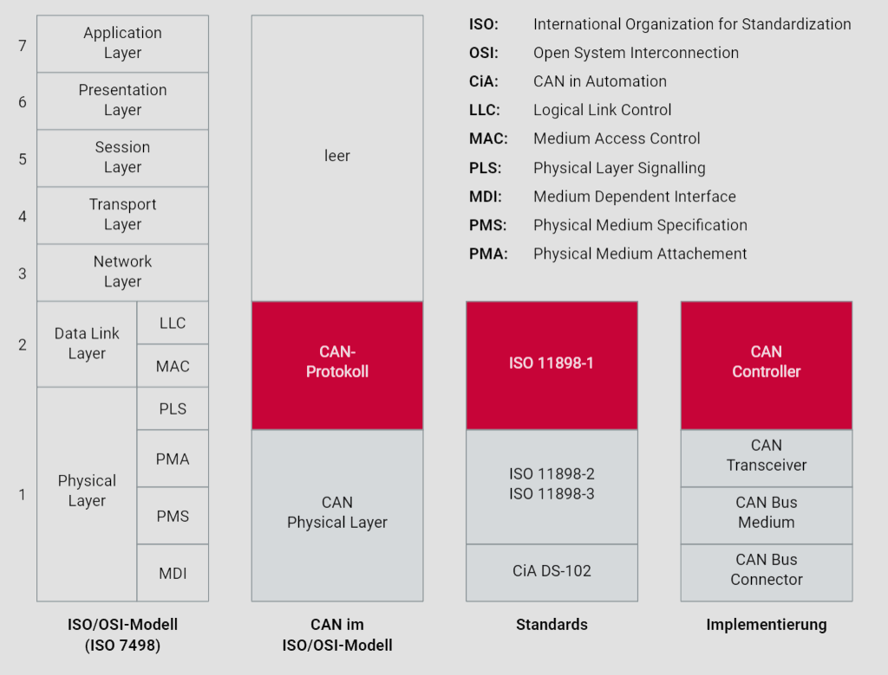

# 1. Einführung

## 1.1. Motivation für CAN

Die Automobilindustrie hat eine lange Tradition der Innovation, angetrieben durch die Notwendigkeit, sich ständig verändernden Anforderungen und Herausforderungen anzupassen. In den letzten Jahrzehnten hat die zunehmende Integration von Elektronik in Fahrzeuge die Branche grundlegend verändert. Ein herausragendes Beispiel für technologische Innovation in diesem Bereich ist das Controller Area Network (CAN), das die Art und Weise, wie Fahrzeuge entworfen, entwickelt und betrieben werden, revolutioniert hat.

Moderne Fahrzeuge sind zunehmend komplexer geworden und erfordern effizientere Methoden zur Integration elektronischer Systeme. Frühe Ansätze, bei denen eigenständige Steuergeräte verwendet wurden, konnten den steigenden Anforderungen nicht mehr gerecht werden. Die Einführung des CAN-Busses löste dieses Problem, indem ein effizienter, bitserieller Datenaustausch über einen einzigen Kommunikationskanal ermöglicht wurde.

In den 1980er Jahren standardisierte Bosch den CAN-Bus, was den Grundstein für eine nahtlose Kommunikation zwischen verschiedenen elektronischen Steuergeräten im Fahrzeug legte. Die Zuverlässigkeit und Sicherheit der Datenübertragung des CAN-Busses erfüllen die strengen Echtzeitanforderungen der Automobilindustrie. Die Implementierung von CAN führte nicht nur zu einer signifikanten Reduzierung der Verkabelungskosten und des Platzbedarfs, sondern vereinfachte auch die Systemintegration. Die komplexen und sperrigen Kabelbäume der Vergangenheit wurden durch eine schlankere und effizientere Fahrzeugarchitektur ersetzt.

Die kontinuierliche Weiterentwicklung von CAN verdeutlicht, wie Technologie dazu beiträgt, die Leistungsfähigkeit und Zuverlässigkeit moderner Fahrzeuge zu verbessern. Die Automobilindustrie setzt weiterhin auf CAN und baut auf dieser bewährten Technologie auf, um zukünftige Herausforderungen zu meistern und innovative Lösungen für die Mobilität von morgen zu entwickeln.

## 1.2. Standardisierung

Das CAN-Protokoll (Controller Area Network) ist eine seit 1994 standardisierte Technologie, die hauptsächlich durch drei ISO-Dokumente beschrieben wird. Die ISO 11898-1 definiert das CAN-Protokoll und umfasst den Data Link Layer (MAC - Medium Access Control, LLC - Logical Link Control) sowie den Physical Layer (PLS - Physical Signalling) gemäß dem Referenzmodell der Datenkommunikation.

Die Implementierung des CAN-Protokolls erfolgt in Hardware durch sogenannte CAN-Controller, die sich hauptsächlich in ihrem Umgang mit CAN-Botschaften unterscheiden. Es gibt CAN-Controller mit Objektespeicherung (Full-CAN-Controller) und solche ohne Objektespeicherung (Basic-CAN-Controller).

Die ISO 11898-2 und ISO 11898-3 beschreiben die Unterschichten PMA (Physical Medium Attachment) und PMS (Physical Medium Specification) des Referenzmodells der Datenkommunikation. Sie definieren zwei verschiedene CAN Physical Layer: den CAN-High-Speed Physical Layer und den CAN-Low-Speed Physical Layer, die sich hauptsächlich in der Spannungsdefinition und der Datenübertragungsgeschwindigkeit unterscheiden.

Die Datenraten variieren je nach ISO-Dokument. Die ISO 11898-3 erlaubt Datenraten bis zu 125 KBit/s und wird hauptsächlich im Komfortbereich des Fahrzeugs eingesetzt. Die ISO 11898-2 ermöglicht Datenraten bis zu 1 MBit/s und findet vor allem Anwendung im Antriebs- und Fahrwerksbereich. Für die Unterschicht MDI (Medium Dependent Interface) des Physical Layers gibt es keinen Standard, aber die CiA DS-102 (CAN in Automation) empfiehlt bestimmte Steckertypen und Belegungen.

Das CAN-Protokoll ermöglicht eine ereignisgesteuerte Kommunikation gemäß der ISO 11898-1. Bei hoher Buslast kann es zu Verzögerungen kommen, insbesondere bei niederprioritären CAN-Botschaften. Um eine deterministische Kommunikation zu gewährleisten, bietet die ISO 11898-4 eine Time Triggered Communication-Option für CAN-basierte Netzwerke an, die eine zeitgesteuerte Kommunikation ermöglicht.

Das ISO/OSI-Referenzmodell der Datenkommunikation bildet den Rahmen für das CAN-Protokoll und dessen Implementierung. Die Grafik "Standard und Implementierung" zeigt den Zusammenhang zwischen diesen Elementen auf. Durch die klare Strukturierung und Standardisierung bietet das CAN-Protokoll eine robuste und zuverlässige Grundlage für die Kommunikation in verschiedensten Anwendungen, insbesondere im Automobilbereich.

